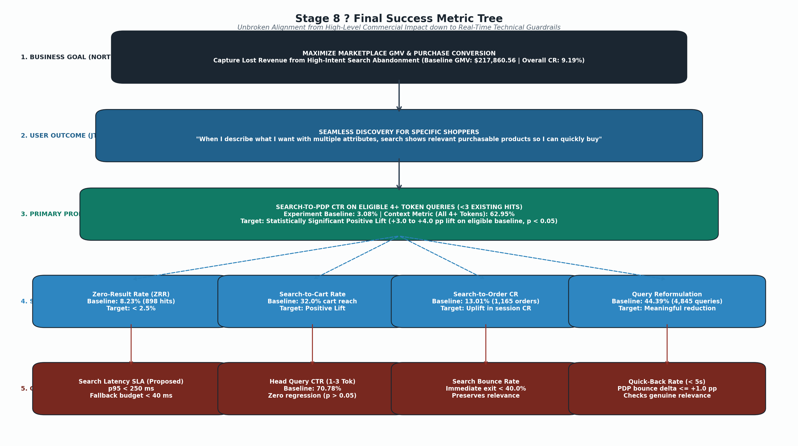
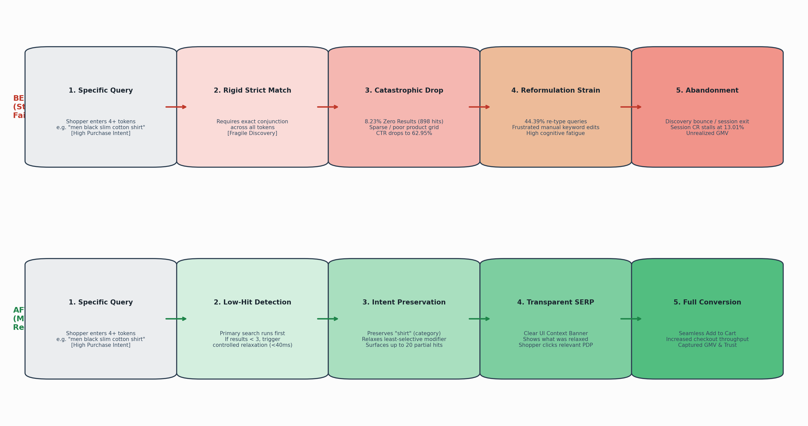
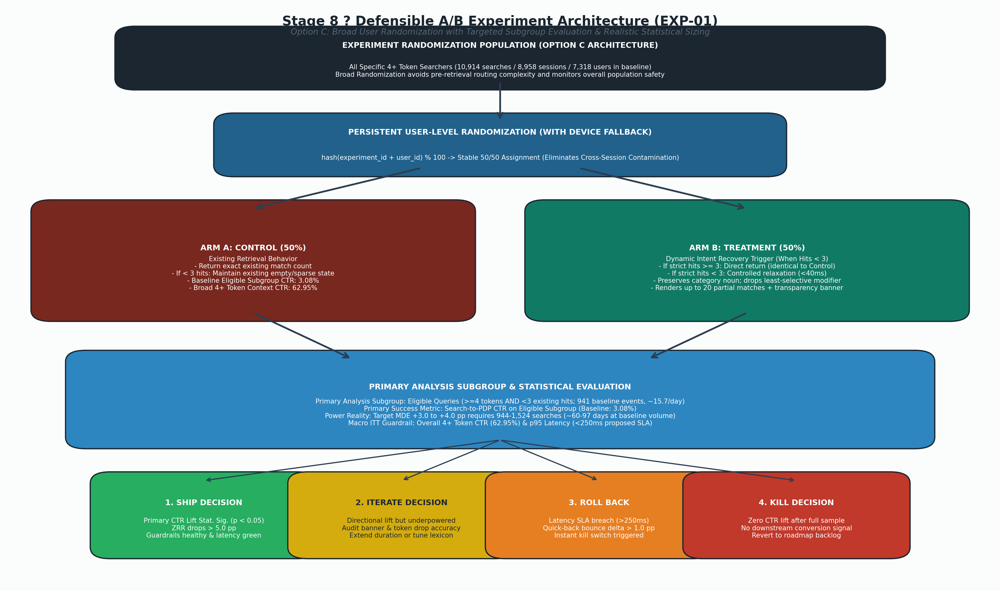
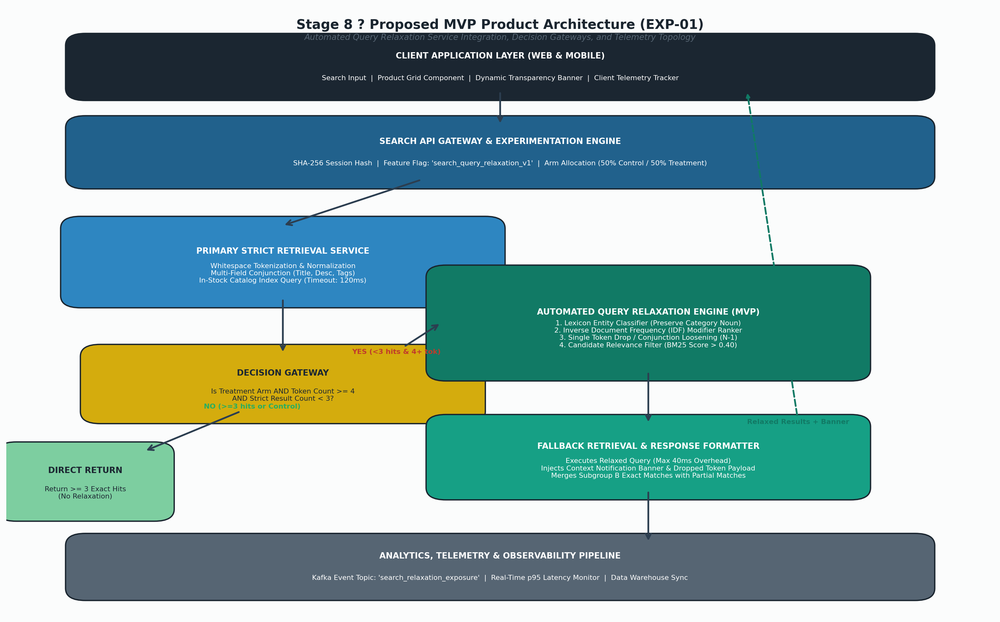

# E-Commerce Product Analytics ? Search & Conversion Funnel

> A data-driven product analytics case study identifying search discovery and checkout friction, validating behavioral hypotheses, prioritizing product opportunities, and designing an experimentally testable search-recovery MVP.

[](https://www.python.org/)
[](sql/)
[](https://duckdb.org/)
[](https://pandas.pydata.org/)
[](notebooks/)
[](docs/)

---

## Executive Summary

In an e-commerce fashion marketplace, I investigated where shoppers were losing momentum across the discovery-to-purchase funnel. Analyzing 119,390 event rows spanning 31,328 customer sessions and 32,245 search queries in DuckDB, I found that search-engaged shoppers represent the highest-intent customer segment, converting at **11.92% vs. 4.75% for browse shoppers** (a 2.51x conversion advantage).

However, high-intent shoppers entering specific multi-attribute queries ($\ge 4$ tokens) encounter severe discovery friction: an **8.23% Zero-Result Rate (ZRR)** (vs. 1.78% on short head queries) and a depressed click-through rate (**62.95% vs. 70.78%**). Among queries returning fewer than 3 results (941 events), Search-to-PDP click-through collapses to just **3.08%**.

Evaluating four competing product problem candidates using RICE prioritization, I prioritized **Search Discovery Failure** as the primary opportunity. I designed a lightweight, transparent MVP?**Automated Query Relaxation / Soft-Match Fallback**?and an experimentally rigorous A/B testing framework (EXP-01) with persistent user randomization and clear guardrails to validate conversion recovery before engineering deeper semantic retrieval systems.

---

## Business Problem

The core objective was to diagnose where shoppers lose momentum across the six core stages of the customer journey:

$$	ext{Search} \longrightarrow 	ext{Product Discovery} \longrightarrow 	ext{Product Detail (PDP)} \longrightarrow 	ext{Cart} \longrightarrow 	ext{Checkout} \longrightarrow 	ext{Order}$$

Search is the primary discovery engine for high-intent shoppers:
- **Search volume:** 32,245 search events across 31,328 sessions.
- **Conversion leverage:** Search sessions achieve **11.92% session conversion** vs. **4.75% for non-search browse sessions** ($Z = 22.4, p < 0.0001$).
- **Revenue contribution:** Search-driven transactions generate over 50% of completed orders ($217,860.56 total GMV).

When search fails to return purchasable items for high-intent shoppers, discovery stalls, session momentum is lost, and potential high-margin transactions abandon the platform.

---

## Dataset

This case study is built upon a schema-validated synthetic fashion marketplace dataset generated via Python (`seed=42`) and managed in DuckDB. The schema enforces strict referential integrity, event chronology, and commercial realism.

### Data Model & Validated Scale (7 Core Tables)
- **`users`**: 16,000 registered accounts (loyalty tiers, acquisition channels, device defaults).
- **`sessions`**: 31,328 customer sessions across iOS, Android, Desktop, and Mobile Web.
- **`products`**: 1,600 unique apparel products across 8 categories with size-level inventory.
- **`search_events`**: 32,245 queries with token counts, filter selections, and result counts.
- **`product_views`**: 44,573 detail page views with size selection, stock status, and dwell time.
- **`cart_events`**: 8,364 cart additions with item quantities and unit prices.
- **`orders`**: 2,880 completed transactions totaling **$217,860.56 in GMV**.
- **Total Facts/Events**: **119,390 event rows** across all fact tables.

> **Portfolio Methodology Note:** This is a synthetic-data portfolio project. Findings demonstrate the analytical and product reasoning workflow rather than representing real marketplace performance. All numbers cited below are strictly validated against `data/ecommerce_analytics.duckdb`.

---

## Key Findings

| # | Finding | Empirical Evidence | Product Interpretation |
|---|---|---|---|
| **1** | **Search-engaged shoppers convert better** | **11.92% vs. 4.75%** ($Z = 22.4, p < 0.0001$) | Search is a high-intent discovery surface; search experience quality directly dictates commercial throughput. |
| **2** | **4+ token queries have higher zero-result rates** | **8.23% vs. 1.78%** ($Z = 24.3, p < 0.0001$) | Specific intent is more vulnerable to strict boolean retrieval failure on multi-attribute queries. |
| **3** | **Specific queries exhibit weaker engagement** | **62.95% vs. 70.78%** Search $	o$ PDP CTR | High-intent shoppers experience discovery friction; 44.39% re-type queries in frustration. |
| **4** | **Size availability strongly affects ATCR** | **19.84% in-stock vs. 2.74% out-of-stock** ($OR = 8.87$) | Stockouts create PDP dead ends; inventory transparency upstream prevents wasted clicks. |
| **5** | **Near-threshold basket behavior shows a conversion cliff** | **29.37% ($38?$49) vs. 44.65% ($50+)** Cart $	o$ Order | Free-shipping economics create cart abandonment right below the threshold. |
| **6** | **Mobile Web has weaker Cart $	o$ Order conversion** | **29.63% Mobile Web vs. 42.94% Native Apps** | Checkout friction is a secondary opportunity (13.31 pp pooled native gap; touches 1,647 cart sessions). |

---

## Product Problem

### Primary Problem
**Search Discovery Failure on Specific, Multi-Attribute Queries**

Evidence supports the hypothesis that multi-attribute, high-intent queries experience severe discovery breakdown due to strict boolean keyword retrieval:
- **33.85% of all queries** (10,914 / 32,245) contain 4+ whitespace-delimited tokens (e.g., `"women floral midi dress red"`).
- **Elevated Zero-Result Rate:** 8.23% of 4+ token queries (898 events) return 0 results, compared to only 1.78% (380 events) for 1?3 token head queries ($p < 0.0001$).
- **Sub-3 Result Breakdown:** An additional 43 queries return only 1?2 items, bringing the underperforming cohort to **941 searches**.
- **Engagement Collapse:** While the macro context CTR across all 4+ token queries is **62.95%**, the click-through rate among the 941 low-result queries drops to a catastrophic **3.08%** (29 clicks).
- **Downstream Session Abandonment:** Shoppers attempting 4+ token queries convert at **13.01%** (1,165 orders / 8,958 sessions), trailing the 14.85% baseline for specific browse-and-buy patterns.

---

## Opportunity Prioritization

To ensure objective resource allocation, I scored four competing funnel opportunities across Reach, Impact, Confidence, and Effort:

| Problem Candidate | Description | Reach | Impact | Confidence | Effort | RICE Score | Priority |
|---|---|:---:|:---:|:---:|:---:|:---:|:---:|
| **A. Search Discovery Failure** | Multi-attribute query zero-result & engagement collapse | 8,958 sessions (28.6%) | 4 | 80% | 4 | **64.0** | **Rank 1 (Primary)** |
| **B. Mobile Web Checkout Friction** | 13.31 pp Cart $	o$ Order gap vs. native apps | 1,647 cart sessions (5.3%) | 4 | 80% | 3 | **31.5** | **Rank 2 (Secondary)** |
| **C. Shipping Threshold Cliff** | Sub-$50 cart drop-off cliff ($38?$49 basket tier) | 1,515 near-threshold carts | 3 | 70% | 2 | **12.0** | **Rank 3** |
| **D. PDP Size Stockout Leaks** | Out-of-stock size selection driving 2.74% ATCR | 4,218 stockout views | 3 | 70% | 5 | **9.9** | **Rank 4** |

### Prioritization Rationale
While Mobile Web checkout friction has a large percentage-point deficit, **Search Discovery Failure** was prioritized because:
1. **Upstream Funnel Position:** Upstream discovery fixes expand top-of-funnel throughput, compounding down through every subsequent funnel step.
2. **Intent & Commercial Scale:** Touches 8,958 sessions (5.4x more sessions than Mobile Web checkout).
3. **Actionable Intervention Point:** Solvable with software and algorithm improvements without merchant inventory changes.

---

## Product Decision

> **Prioritize Search Discovery Failure as the primary product opportunity.**

### Strategic Rationale
- **Highest Intent Users:** Shoppers formulating specific queries know exactly what they want; failing them causes immediate churn.
- **Measurable Behavioral Failure:** Validated 8.23% ZRR and 3.08% eligible CTR give a clear, unambiguous baseline.
- **Clear Intervention Point:** Fallback query relaxation can intercept empty result states in real-time.
- **Low Engineering Complexity vs. Semantic Retrieval:** Rule-based query relaxation delivers immediate user recovery at a fraction of the cost, latency, and operational complexity of large-scale vector search.

---

## MVP ? Automated Query Relaxation

The proposed MVP is an **Automated Query Relaxation / Soft-Match Fallback** service that intercepts low-result multi-attribute searches without altering head-query retrieval.

```
Shopper submits query: "women floral midi dress red"
         ?
         ?
Existing Search Retrieval Pipeline
         ?
         ?
Does query have ?4 tokens AND return <3 results?
   ??? NO  ??? Render standard results normally (0ms overhead)
   ?
   ??? YES ??? Trigger Query Relaxation Engine
                 ?
                 ??? 1. Preserve primary category noun ("dress")
                 ??? 2. Identify least-selective modifier (highest document frequency, e.g., "red")
                 ??? 3. Drop modifier and execute fallback search ("women floral midi dress")
                 ??? 4. Apply relevance, category consistency, & stock filters
                 ??? 5. Return top 20 ranked relevant items
                 ??? 6. Render transparent banner:
                        "Showing 18 closest matches for 'women floral midi dress' (relaxed 'red')"
                        [Show exact matches only (0 results)]
```

### Proposed MVP Product Behavior (10 Steps)
1. User submits a search query in the search input field.
2. Existing retrieval executes normally.
3. If the query has $\ge 4$ whitespace-separated tokens and produces $< 3$ in-stock results, the fallback engine triggers.
4. The system parses tokens, identifying and protecting primary category nouns (`dress`, `shoes`, `jacket`).
5. The system computes document frequency across catalog metadata to identify the least-selective modifier.
6. The engine drops the least-selective modifier to formulate a relaxed query.
7. Fallback retrieval fetches candidate partial matches.
8. The UI renders up to 20 ranked, in-stock matching products.
9. A transparent status banner informs the user: *"Showing closest matches with [term] removed"*.
10. A one-tap toggle allows the user to view strict exact results.

---

## Product Safety & Relevance

To preserve user trust, fallback retrieval enforces strict quality guardrails:
- **Relevance Score Threshold:** Candidate products must meet an offline-calibrated minimum relevance score before display (proposed threshold to be tuned offline; not arbitrary BM25 assumptions).
- **Category Consistency:** Products from unrelated root categories are strictly excluded (e.g., relaxing a dress query never returns footwear).
- **Product Availability Filter:** Out-of-stock items are suppressed from fallback results to prevent size dead ends.
- **Deduplication:** Any items returned by primary retrieval appear first without duplicates.
- **Latency Budget:** Proposed p95 latency budget $\le 250	ext{ ms}$ ($\le 50	ext{ ms}$ allocated to relaxation logic).
- **User Transparency:** Shoppers are always informed that relaxation occurred, with a single-click strict override.

---

## Experiment Design (EXP-01)

To validate the MVP without exposing the full marketplace to risk, I designed a randomized controlled A/B experiment.

### Experiment Structure
- **Randomization Unit:** Persistent user-level hashing: `hash(experiment_id + user_id) % 100` (50% Control, 50% Treatment), with device cookie fallback for anonymous guest sessions.
- **Eligibility Trigger:** The query relaxation intervention is dynamically triggered **only when a search has $\ge 4$ tokens AND primary retrieval returns $< 3$ in-stock products**.
- **Control Group ($A$):** Standard search experience; queries with $< 3$ results render the existing empty/low-result screen.
- **Treatment Group ($B$):** Automated Query Relaxation renders up to 20 relevant products with a transparency banner.

### Metric Hierarchy
- **Primary Metric:** Search-to-PDP Click-Through Rate (CTR) on the eligible cohort ($\ge 4$ tokens, $< 3$ hits).
- **Secondary Metrics:**
  - Zero-Result Rate (ZRR) on 4+ token queries.
  - Query Reformulation Rate within 30 seconds.
  - Add-to-Cart Rate (ATCR) from search result pages.
- **Guardrail Metrics:**
  - Search Gateway p95 Latency ($\le 250	ext{ ms}$).
  - Search Bounce Rate ($< 40\%$).
  - Quick-Back Bounce Rate (PDP dwell $< 5	ext{ s}$ delta $\le +1.0	ext{ pp}$).
  - Head-Query (1?3 token) CTR (neutral; non-inferiority margin $-0.5	ext{ pp}$).
- **Rollback Criteria:** Automatic rollback if p95 latency $> 350	ext{ ms}$ for 15 minutes, or if search bounce rate increases by $> +3.0	ext{ pp}$.

### Metric Role Distinction
- **Macro Context Metric (Guardrail):** **62.95% CTR** across *all* 10,914 4+ token searches.
- **Experimental Baseline (Target):** **3.08% CTR** among the *eligible* cohort of 941 low-result queries (29 clicks).

---

## Statistical Power Analysis

A rigorous sample size calculation illustrates the trade-off between effect size and runtime in this catalog:

| Metric Parameter | Value / Calculation | Product Interpretation |
|---|---|---|
| **Baseline CTR ($p_1$)** | **3.08%** (29 clicks / 941 searches) | Measured baseline on the eligible sub-cohort. |
| **Statistical Parameters** | $lpha = 0.05$ (two-tailed), $1 - eta = 0.80$ | Standard experimentation rigor. |
| **Eligible Traffic Velocity** | ~15.7 eligible searches / day (~941 per 60-day baseline) | Synthetic catalog constraint. |
| **Target MDE: $+3.5	ext{ pp}$** | Lift from 3.08% to 6.58% | Requires ~1,172 eligible searches (~75 days). |
| **Canary Test MDE: $+5.0	ext{ pp}$** | Lift from 3.08% to 8.08% | Requires ~440 eligible searches (~28 days / 4 weeks). |

> **Power Reality:** In this single-catalog environment, a 4-week canary experiment is powered to detect transformational lifts ($\ge +5.0	ext{ pp}$). In a production deployment across multiple merchandise categories, aggregated search traffic would enable detecting subtler $+1.5	ext{ pp}$ lifts within standard 14-day test cycles.

---

## Technical Architecture

```
User Search Request
        ?
        ?
?????????????????????????????????????????????????
? Search Gateway / API Service                  ?
? ? Validates request & parses query tokens     ?
? ? Assigns/verifies persistent experiment hash ?
?????????????????????????????????????????????????
                        ?
                        ?
?????????????????????????????????????????????????
? Primary Search Retrieval (Elastic / OpenSearch)?
? ? Executes exact multi-attribute search       ?
?????????????????????????????????????????????????
                        ?
                        ?
              Result Count Check
               ??? If Result Count ? 3  ??? Return Normal Results
               ??? If Result Count < 3  ??? Query Relaxation Service
                                                    ?
                        ?????????????????????????????????????????????????????????
                        ?                                                       ?
           [Control: User in Group A]                              [Treatment: User in Group B]
                        ?                                                       ?
         Render Default Low-Result Screen                        1. Noun Extraction & Token Drop
                        ?                                        2. Fallback Candidate Retrieval
                        ?                                        3. Relevance & Stock Filtering
                        ?                                        4. Rank Top 20 Results
                        ?                                                       ?
                        ?                                                       ?
         Existing Low-Result View                                Transparent UI Banner + Results
```

---

## Selected Visuals

| E-Commerce Funnel Breakdown | Search Zero-Result Rate by Token Length |
|:---:|:---:|
|  |  |
| *Funnel progression across 31,328 sessions revealing discovery drop-offs.* | *Zero-result rate spikes from 1.78% on short queries to 8.23% on 4+ tokens.* |

| Product Metric Tree | MVP User Journey & Recovery Flow |
|:---:|:---:|
|  |  |
| *North Star GMV breakdown connecting search CTR to revenue.* | *Step-by-step query relaxation and transparent user fallback.* |

| Controlled A/B Experiment Architecture | Technical System Design |
|:---:|:---:|
|  |  |
| *Persistent user randomization with dynamic conditional triggering.* | *Low-latency search gateway, token analyzer, and fallback pipeline.* |

---

## Repository Structure

```
ecommerce-product-analytics/
??? README.md                                  <- Executive project case study (this file)
??? requirements.txt                           <- Python dependencies (pandas, duckdb, scipy, etc.)
??? .gitignore                                 <- Excludes bytecode, checkpoints, and IDE artifacts
?
??? data/
?   ??? raw/                                   <- 7 reproducible raw event CSVs (119k+ rows)
?   ??? ecommerce_analytics.duckdb             <- Embedded analytical DuckDB database
?
??? src/
?   ??? data_generation.py                     <- Reproducible synthetic data generator (Seed 42)
?   ??? data_validation.py                     <- 59 automated data-quality checks
?   ??? run_sql_suite.py                       <- SQL analytical suite execution runner
?   ??? exploratory_analysis.py                <- Statistical analysis and visualization pipeline
?   ??? problem_prioritization.py              <- RICE prioritization calculation engine
?   ??? solution_prioritization.py             <- Solution exploration & trade-off scoring
?   ??? final_prd_validation.py                <- 25-check automated portfolio audit suite
?
??? sql/
?   ??? 01_data_quality_audit.sql              <- Schema integrity, zero-orphan checks
?   ??? 02_overall_funnel.sql                  <- Step conversion and session drop-off audit
?   ??? 03_search_performance.sql              <- Query length, ZRR, and search CTR analysis
?   ??? 04_pdp_and_sizing.sql                  <- Dwell time and size stockout impact on ATCR
?   ??? 05_cart_checkout.sql                   <- Cart abandonment and shipping threshold cliff
?   ??? 06_platform_analysis.sql               <- Platform funnel breakdown (iOS/Android/Web)
?   ??? 07_user_segmentation.sql               <- Loyalty tier and acquisition cohort analysis
?   ??? 08_category_analysis.sql               <- Merchandise opportunity matrix (Traffic vs ATCR)
?   ??? 09_period_comparison.sql               <- Period 1 vs Period 2 KPI trend analysis
?   ??? 10_opportunity_analysis.sql            <- Quantified revenue opportunity sizing
?   ??? README.md                              <- SQL execution instructions and dictionary
?
??? notebooks/
?   ??? 01_funnel_validation.ipynb             <- Funnel drop-off validation and session tracking
?   ??? 02_search_deep_dive.ipynb              <- Query token length, ZRR, and CTR breakdown
?   ??? 03_pdp_sizing_analysis.ipynb           <- Dwell time and stockout ATCR deficit
?   ??? 04_checkout_friction.ipynb             <- Shipping threshold cliff and cart economics
?   ??? 05_platform_segmentation.ipynb         <- Mobile Web checkout conversion gap analysis
?   ??? 06_root_cause_analysis.ipynb           <- Behavioral hypothesis validation & trees
?   ??? 07_product_problem_prioritization.ipynb<- RICE scoring framework and opportunity matrix
?   ??? 08_solution_exploration.ipynb          <- MVP solution space, power sizing, trade-offs
?   ??? 09_final_prd_validation.ipynb          <- Automated programmatic audit of metrics and PRD
?
??? docs/
?   ??? final_prd.md                           <- 29-section executive Product Requirements Document
?   ??? final_product_spec.md                  <- Engineering specification, API schemas, pseudocode
?   ??? portfolio_case_study.md                <- Concise 1-page PM portfolio case study
?   ??? interview_talking_points.md            <- 28 PM interview Q&As across product and analytics
?   ??? project_walkthrough.md                 <- 3?5 minute verbal presentation walkthrough script
?   ??? product_problem_definition.md          <- Comprehensive problem framing and RICE breakdown
?   ??? solution_strategy.md                   <- Solution exploration, architectural options, trade-offs
?
??? reports/
    ??? sql_analysis_results.md                <- Markdown output from executing the 10 SQL scripts
    ??? exploratory_analysis_report.md         <- Statistical validation and behavioral analysis report
    ??? final_requirements.csv                 <- 21 functional, non-functional, and data requirements
    ??? final_metrics_dictionary.csv           <- 11 metric definitions, baselines, and targets
    ??? final_edge_cases.csv                   <- 16 production edge cases with defined system behaviors
    ??? final_rollout_plan.csv                 <- Gated 5-phase canary and production rollout schedule
    ??? final_experiment_spec.csv              <- Complete EXP-01 experiment parameters
    ??? final_portfolio_audit.md               <- Portfolio readiness audit and checklist
    ??? problem_prioritization.csv             <- RICE calculation table for problem candidates
    ??? solution_prioritization.csv            <- Evaluated solution scoring table
    ??? figures/                               <- 22 high-resolution analytical and architectural charts
```

---

## Getting Started

### 1. Clone & Environment Setup
```bash
git clone https://github.com/ansh07verma/ecommerce-product-analytics.git
cd ecommerce-product-analytics
pip install -r requirements.txt
```

### 2. Regenerate Synthetic Dataset (Optional)
The validated dataset is pre-committed in `data/`. To rebuild it from scratch:
```bash
python src/data_generation.py
```

### 3. Run Automated Data Validation
Execute the 59 automated integrity checks against the database:
```bash
python src/data_validation.py
```

### 4. Execute Full SQL Analytical Suite
Run all 10 SQL audit scripts against DuckDB and generate the consolidated results report:
```bash
python src/run_sql_suite.py
```

### 5. Run Automated PRD & Metrics Audit
Validate all 25 portfolio assertions, DuckDB metrics, and schema consistency:
```bash
python src/final_prd_validation.py
```

### 6. Explore Jupyter Notebooks
Launch the exploratory analysis and experimentation notebooks:
```bash
jupyter notebook notebooks/
```

---

## Product Documentation

For deep dives into specific product deliverables:
- **[Product Requirements Document (PRD)](docs/final_prd.md):** 29-section executive PRD with user personas, user stories, functional requirements, and launch gates.
- **[Technical Product Specification](docs/final_product_spec.md):** Architecture diagrams, tokenization logic, fallback algorithms, API schemas, and latency budgets.
- **[Portfolio Case Study](docs/portfolio_case_study.md):** 3-minute executive summary for senior hiring managers and recruiters.
- **[Interview Talking Points](docs/interview_talking_points.md):** 28 interview-ready Q&As covering product strategy, statistical rigor, and technical feasibility.
- **[Verbal Presentation Walkthrough](docs/project_walkthrough.md):** 3?5 minute conversational script for live portfolio presentations.
- **[Problem Definition & RICE Scoring](docs/product_problem_definition.md):** Deep-dive into problem candidates and scoring methodology.
- **[Solution Strategy & Trade-Offs](docs/solution_strategy.md):** Exploration of rule-based vs. semantic vs. query-relaxation approaches.
- **[SQL Analysis Report](reports/sql_analysis_results.md):** Full execution outputs from the 10-script DuckDB analytical suite.
- **[Experiment Specification](reports/final_experiment_spec.csv):** Detailed parameter definitions for the EXP-01 A/B test.

---

## Limitations

1. **Synthetic Dataset:** All data was generated synthetically using realistic e-commerce distributions (`seed=42`). While statistically coherent, it does not represent real-world customer unpredictability.
2. **Absence of Qualitative User Research:** Quantitative drop-offs identify *where* and *what* friction occurs, but qualitative user interviews and usability testing would be needed in production to confirm *why* shoppers abandon.
3. **No Production Search Relevance Judgments:** Human relevance judgments (e.g., NDCG@10, binary relevance audits) are required to tune relevance scoring offline before shipping to live customers.
4. **Offline Calibration Required:** Non-functional parameters?such as the minimum relevance threshold and the 250ms p95 latency budget?are proposed specifications requiring production benchmarking.
5. **Single-Catalog Traffic Velocity:** The synthetic catalog yields ~15.7 eligible queries/day, limiting the minimum detectable effect in a 4-week test. Real-world marketplace deployment across larger catalogs provides the traffic needed for rapid power convergence.
6. **Observational Correlation vs. Causality:** Historical funnel differences highlight behavioral associations; true causality is only proven through the proposed randomized controlled experiment.

---

## Product Skills Demonstrated

- **Funnel & Behavioral Analytics:** Multi-step conversion audits, session-level attribution, and drop-off analysis.
- **Advanced SQL & Database Modeling:** Complex CTEs, window functions, and referential integrity audits in DuckDB.
- **Statistical Hypothesis Testing:** Two-proportion $Z$-tests, odds ratios, confidence intervals, and p-value evaluation.
- **Root-Cause Reasoning:** Distinguishing symptoms from core drivers using structured problem breakdown trees.
- **Opportunity Prioritization:** Objective RICE scoring balancing commercial reach, conversion impact, and engineering effort.
- **PRD & Product Specification:** Authoring industry-standard 29-section PRDs and detailed technical specifications.
- **Experiment Design & Power Sizing:** Randomized controlled A/B test design, eligibility gating, MDE calculation, and sample sizing.
- **Metric Architecture:** North Star decomposition, input/output metric hierarchies, and operational guardrail definitions.
- **Cross-Functional Collaboration:** Partnering with data science, search infrastructure, and frontend engineering on technical feasibility.
- **Risk Mitigation & Rollout Planning:** 5-phase gated rollout schedules, automated rollback criteria, and edge-case catalogs.

---

## Author & Contact

**E-Commerce Product Analytics Case Study**
- **Focus:** Product Management | Product Analytics | Search & Growth
- **Repository:** [https://github.com/ansh07verma/ecommerce-product-analytics](https://github.com/ansh07verma/ecommerce-product-analytics)
