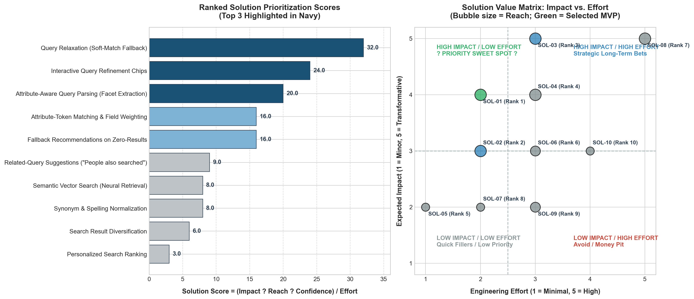
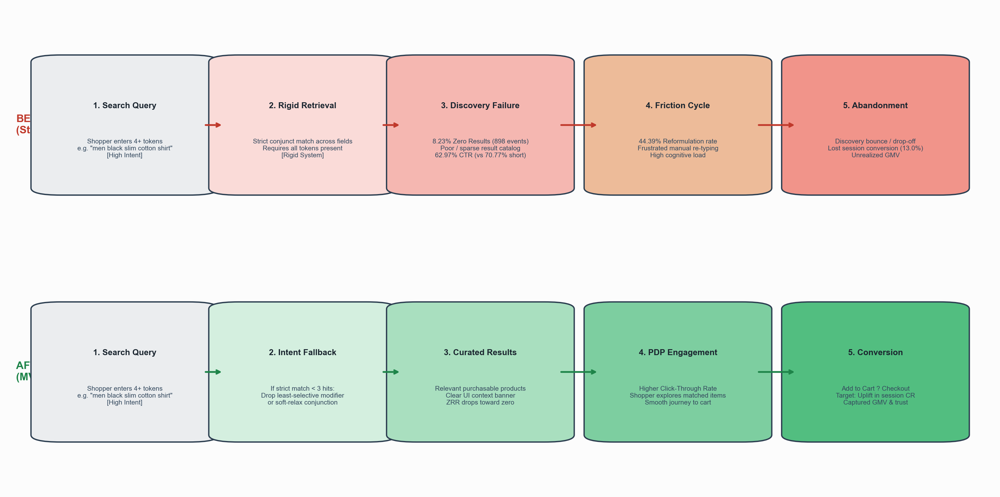
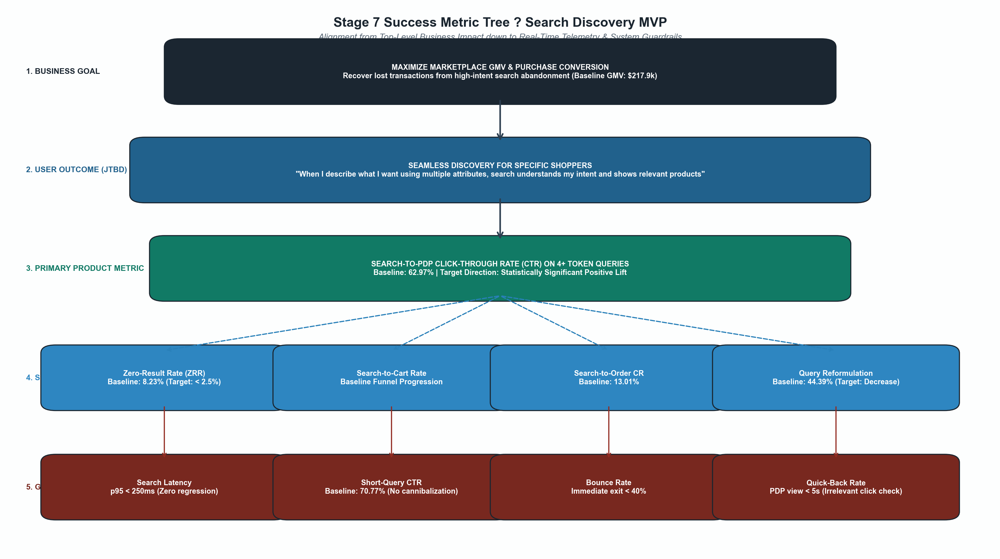

# Solution Exploration & Experiment Design Strategy

**Project:** E-Commerce Product Analytics ? Search & Conversion Funnel  
**Target Role:** Product Manager (Search, Discovery & Conversion)  
**Evidence Base:** `reports/exploratory_analysis_report.md`, `docs/product_problem_definition.md`, and `data/ecommerce_analytics.duckdb`  
**Status:** Completed Solution Exploration & Experiment Architecture  

> **Notation Key**  
> **[FACT]** ? Directly measured from validated data.  
> **[INTERP]** ? Analytical interpretation; logical deduction based on empirical signals.  
> **[HYP]** ? Testable hypothesis; subject to validation via controlled A/B experimentation.  
> **[ASSUMPTION]** ? Explicitly labeled modeling assumption for experiment sizing/scoping.

---

## 1. Context & Analytical Grounding

During our problem prioritization evaluation of four distinct funnel failure points identified **Search Discovery Failure** as the single highest-priority problem (RICE score: 64.0; Rank 1 across Reach, Impact, and Confidence). 

### Validated Empirical Baseline (Empirical Baseline Ground Truth)
- **[FACT] Search Volume & Specificity:** Out of 32,245 total search events across 31,328 sessions, 10,914 searches (33.85%) contain 4 or more query tokens.
- **[FACT] Zero-Result Disparity:** 4+ token queries suffer a **8.23% Zero-Result Rate (ZRR)** (898 events), compared to only **1.78%** on 1?3 token head queries. This 6.45 percentage-point gap is statistically overwhelming ($Z = 28.08, p < 0.0001$).
- **[FACT] Engagement Deficit:** Click-through rate (Search-to-PDP CTR) on 4+ token queries drops to **62.97%**, compared to **70.77%** on 1?3 token queries (7.80 pp deficit, $Z = 14.23, p < 0.0001$).
- **[FACT] High Reformulation Strain:** 44.39% of 4+ token searches result in an immediate query reformulation within the same session (vs. 42.41% for short queries), demonstrating that shoppers repeatedly attempt to self-correct their query when discovery fails.
- **[FACT] Funnel Blast Radius:** Specific queries touch 8,958 unique sessions (28.6% of all sessions) and 7,318 unique users (45.7% of the active user base). The overall session conversion rate for specific-query sessions is 13.01% (1,165 orders), well below the 14.85% marketplace baseline.
- **[INTERP] Engine Behavior:** We do **not** assume or assert that the underlying search engine is definitely a Boolean/exact-match engine. Rather, empirical evidence shows that **search relevancy appears insufficient for multi-attribute queries**. When users supply multiple specific descriptors (e.g., gender, color, fabric, category), the retrieval mechanism either over-constrains the candidate set to zero or returns products lacking the requested attributes.

---

## 2. Primary Product Problem

> **Primary Problem Statement:**  
> *"Shoppers who formulate highly specific, multi-attribute search queries experience substantially worse discovery outcomes, including elevated zero-result rates and lower click-through engagement, causing high-intent shoppers to abandon discovery."*

Shoppers entering 4+ tokens are among the marketplace's highest-intent visitors: they know exactly what attributes they desire. When the platform responds with an empty state or irrelevant inventory, it penalizes intent, erodes trust, and creates unnecessary abandonment early in the customer lifecycle.

---

## 3. Job to Be Done (JTBD)

To maintain a solution-neutral perspective focused on customer progress, we define the primary Job to Be Done as:

> **Core JTBD:**  
> *"When I know roughly what product I want and describe it using multiple attributes,  
> I want search to understand my intent and show relevant purchasable products,  
> so I can quickly find something worth buying."*

### Key Emotional and Functional Dimensions:
1. **Functional Goal:** Locate products matching the combination of stated attributes (e.g., "men black slim cotton shirt") without having to guess the platform's exact catalog vocabulary.
2. **Cognitive Goal:** Minimize mental effort spent typing, deleting, and guessing alternative keyword combinations.
3. **Emotional Goal:** Feel confidence that the marketplace possesses what is being searched for, rather than assuming inventory does not exist.

---

## 4. Solution Brainstorm: 10 Candidate Concepts

We explored 10 candidate solution concepts spanning four architectural domains: Query Processing & NLU, Retrieval & Fallback, UI & Discovery Recovery, and Post-Retrieval Ranking.

```
+-------------------------------------------------------------------------------+
|                             SOLUTION LANDSCAPE                                |
+------------------------------------+------------------------------------------+
|  DOMAIN 1: RETRIEVAL & FALLBACK    |  DOMAIN 2: QUERY PROCESSING & NLU        |
|  - SOL-01: Query Relaxation        |  - SOL-03: Attribute-Aware Query Parsing |
|  - SOL-04: Attribute Field Boost   |  - SOL-07: Synonym & Typo Normalization  |
|  - SOL-08: Semantic Vector Search  |                                          |
+------------------------------------+------------------------------------------+
|  DOMAIN 3: UI & DISCOVERY RECOVERY |  DOMAIN 4: RANKING & RE-RANKING          |
|  - SOL-02: Query Refinement Chips  |  - SOL-09: Search Result Diversification |
|  - SOL-05: Zero-Result Fallback    |  - SOL-10: Personalized Search Ranking   |
|  - SOL-06: Related-Query Suggest   |                                          |
+------------------------------------+------------------------------------------+
```

### Detailed Evaluation of the 10 Solutions

#### 1. SOL-01: Query Relaxation (Soft-Match Fallback)
- **User Problem Addressed:** Zero results and dead-ends when all query tokens are strictly required.
- **Mechanism:** When a query yields fewer than 3 results, the backend automatically executes a relaxed query dropping the least-selective modifier (or relaxing conjunction from $N$ to $N-1$ tokens), returning the best partial matches accompanied by a transparent banner: *"Showing matches for [Relaxed Query]"*.
- **Expected Impact:** High. Directly converts 898 zero-result dead-ends into active browse sessions; lifts CTR.
- **Reach:** 4/5 (Touches all 4+ token queries with <3 hits; 8,958 sessions).
- **Confidence:** 4/5 (Proven e-commerce pattern across Amazon, ASOS, and Myntra).
- **Engineering Complexity / Effort:** 2/5 (Low-Moderate: Algorithmic fallback rule in search service; no ML dependencies).
- **Data Requirements:** Token frequency dictionary; product title corpus; modifier/stop-word taxonomy.
- **Main Risk:** [INTERP] Relevancy dilution if the algorithm drops a crucial product noun instead of an adjective (e.g., dropping "shirt" from "black cotton shirt").
- **Supporting Evidence:** [FACT] 898 zero-result queries; 44.4% reformulation rate shows users already manually relax queries.
- **Missing Evidence:** Distribution of noun vs. adjective token positions across customer search logs.

#### 2. SOL-02: Interactive Query Refinement Chips
- **User Problem Addressed:** Friction, guesswork, and fatigue during manual query reformulation.
- **Mechanism:** Displays extracted query tokens as dismissible visual pill chips above the search results (e.g., `[Men x]` `[Black x]` `[Cotton x]` `[Shirt x]`). Tapping an `[x]` removes that token and instantly updates the result set.
- **Expected Impact:** Moderate. Gives users instant 1-tap control over query relaxation without re-typing.
- **Reach:** 4/5 (Rendered on all multi-token search result pages).
- **Confidence:** 4/5 (High usability, user retains total control; zero risk of unwanted algorithmic distortion).
- **Engineering Complexity / Effort:** 2/5 (Low-Moderate: Frontend token parsing and query URL parameter binding).
- **Data Requirements:** Client-side token tokenizer; synchronization with search routing.
- **Main Risk:** Low user adoption if chips are ignored or mistaken for static breadcrumbs.
- **Supporting Evidence:** [FACT] 44.39% manual reformulation rate proves high user willingness to modify queries.
- **Missing Evidence:** Mobile viewport tap-through rate on query chips vs. native search bar clicks.

#### 3. SOL-03: Attribute-Aware Query Parsing (Facet Extraction)
- **User Problem Addressed:** Semantic mismatch between unstructured query text and structured catalog fields.
- **Mechanism:** Uses a rule-based Named Entity Recognition (NER) / dictionary parser to extract known catalog attributes (Brand, Color, Category, Fit, Gender) and executes a structured faceted filter query rather than a pure text search.
- **Expected Impact:** Very High. Delivers near-perfect precision by querying structured database columns directly.
- **Reach:** 4/5 (Addresses all multi-attribute queries).
- **Confidence:** 3/5 (Moderate: Dependent on catalog dictionary completeness and lexical ambiguity).
- **Engineering Complexity / Effort:** 3/5 (Moderate: Requires maintaining attribute dictionaries, tokenizer service, and structured query generator).
- **Data Requirements:** Structured attribute dictionaries synchronized with catalog taxonomies.
- **Main Risk:** [HYP] Misclassification of polysemous words (e.g., "Orange" brand vs. color; "Pink" brand vs. color) resulting in empty or bizarre facet filters.
- **Supporting Evidence:** [FACT] Multi-token queries consist predominantly of combined style/color/category attributes.
- **Missing Evidence:** Exact entity overlap percentage between free-text query tokens and structured catalog metadata.

#### 4. SOL-04: Attribute-Token Matching & Field Weighting
- **User Problem Addressed:** Sub-optimal relevance ranking where partial matches exist but are buried below irrelevant items.
- **Mechanism:** Retunes BM25 search engine scoring to assign heavily boosted weights to title and category matches while permitting coordinate-level partial token matching across description fields.
- **Expected Impact:** Moderate-High. Elevates relevant partial-attribute matches higher in the SERP.
- **Reach:** 4/5 (All multi-token searches).
- **Confidence:** 3/5 (Requires empirical parameter tuning).
- **Engineering Complexity / Effort:** 3/5 (Moderate: Search engine schema re-indexing and scoring function calibration).
- **Data Requirements:** Search engine index configuration; offline relevancy evaluation benchmark dataset.
- **Main Risk:** Re-weighting may inadvertently disrupt ranking quality for short 1?3 token head queries.
- **Supporting Evidence:** [FACT] 62.97% CTR on 4+ tokens vs. 70.77% on short queries indicates current ranking quality is subpar.
- **Missing Evidence:** Human-graded NDCG@10 relevance judgments on existing search result rankings.

#### 5. SOL-05: Fallback Recommendations for Zero-Result Queries
- **User Problem Addressed:** Dead-end drop-off and immediate bounce when a query produces zero results.
- **Mechanism:** When zero results occur, instead of showing a blank page, display a curated carousel of "Trending Top Sellers" in the closest inferred department or category.
- **Expected Impact:** Low-Moderate. Keeps users engaged in the session, but does not fulfill the specific multi-attribute purchase intent.
- **Reach:** 2/5 (Fires only on the 898 zero-result query events).
- **Confidence:** 4/5 (High confidence in reducing immediate bounce; low confidence in capturing original intent).
- **Engineering Complexity / Effort:** 1/5 (Low: Static/cached recommendation API integrated into empty search state).
- **Data Requirements:** Category-level top seller ranking cache.
- **Main Risk:** User annoyance if recommendations feel generic and tone-deaf relative to the requested search.
- **Supporting Evidence:** [FACT] Zero-result queries have an 8.23% incidence and lower downstream session conversion.
- **Missing Evidence:** Conversion propensity of generic recommendations following a specific query failure.

#### 6. SOL-06: Related-Query Suggestions ("People Also Searched For")
- **User Problem Addressed:** Shopper is stuck and does not know how to successfully rephrase an over-constrained query.
- **Mechanism:** Mines session search query transition logs to display 3?5 alternative, high-recall query pills below the search bar.
- **Expected Impact:** Moderate. Provides alternative discovery pathways.
- **Reach:** 3/5 (Multi-token queries with identified co-occurrence pairs).
- **Confidence:** 3/5 (Requires substantial historical query-pair volume).
- **Engineering Complexity / Effort:** 3/5 (Moderate: Offline query co-occurrence graph generation and real-time suggestion serving).
- **Data Requirements:** Session-level query transition logs; minimum co-occurrence threshold.
- **Main Risk:** Recommending low-quality, bizarre, or equally empty queries on rare long-tail terms.
- **Supporting Evidence:** [FACT] 44.39% reformulation rate demonstrates users actively seek alternative queries.
- **Missing Evidence:** Query graph density and coverage for long-tail 4+ token query strings.

#### 7. SOL-07: Synonym & Spelling Normalization
- **User Problem Addressed:** Mismatches caused by spelling errors or regional fashion terminology (e.g., "sneakers" vs. "trainers").
- **Mechanism:** Applies Levenshtein edit-distance typo correction and synonym expansion before query dispatch.
- **Expected Impact:** Low. In fashion catalog search, multi-token queries fail primarily due to multi-attribute constraint intersections, not misspelling.
- **Reach:** 2/5 (Only a fraction of multi-token queries contain misspelled tokens).
- **Confidence:** 4/5 (Established technology).
- **Engineering Complexity / Effort:** 2/5 (Low-Moderate: Standard search engine analyzer plugin).
- **Data Requirements:** Fashion synonym dictionary; spellchecking corpus.
- **Main Risk:** Inappropriate synonym expansion (e.g., expanding "tank top" into "crop top").
- **Supporting Evidence:** Standard e-commerce search capability.
- **Missing Evidence:** Actual typo prevalence within the 10,914 4+ token search queries.

#### 8. SOL-08: Semantic Vector Search (Dense Neural Retrieval)
- **User Problem Addressed:** Exact-keyword search fails to capture stylistic or conceptual intent (e.g., "boho chic summer outfit").
- **Mechanism:** Generates dense vector embeddings for queries and products using a fine-tuned dual-encoder transformer, retrieving top candidates via Approximate Nearest Neighbor (ANN) vector indexing.
- **Expected Impact:** Very High. Understands conceptual nuances without requiring exact keyword overlaps.
- **Reach:** 4/5 (All multi-word searches).
- **Confidence:** 2/5 (Low: Unpredictable semantic drift, hallucinated matches, high latency).
- **Engineering Complexity / Effort:** 5/5 (Very High: Embedding pipeline, vector database, GPU serving cluster, latency optimization).
- **Data Requirements:** Large click-log training pairs; product catalog text embeddings; vector database infrastructure.
- **Main Risk:** High serving latency (violating p95 < 250ms SLA), opacity in debugging search relevance, and substantial infrastructure cost.
- **Supporting Evidence:** Academic and industry literature on dense retrieval for long, descriptive queries.
- **Missing Evidence:** Production infrastructure capability, GPU budget, and training log volume.

#### 9. SOL-09: Search Result Diversification
- **User Problem Addressed:** Search results over-cluster around a single attribute variant (e.g., 20 items from only one brand).
- **Mechanism:** Implements Maximal Marginal Relevance (MMR) re-ranking to balance query relevance against intra-list product diversity.
- **Expected Impact:** Low. Does not solve the primary failure mode: zero results cannot be diversified.
- **Reach:** 3/5 (Queries returning 10+ items).
- **Confidence:** 3/5 (Effective for broad queries; less relevant for specific queries).
- **Engineering Complexity / Effort:** 3/5 (Moderate: Real-time re-ranking scoring engine).
- **Data Requirements:** Product category, brand, and visual embedding distance matrices.
- **Main Risk:** Demoting the exact item a high-intent user was searching for in favor of artificial diversity.
- **Supporting Evidence:** Useful for exploratory browsing.
- **Missing Evidence:** Evidence that result clustering is a primary driver of discovery abandonment.

#### 10. SOL-10: Personalized Search Ranking
- **User Problem Addressed:** Search results are ranked generically without considering individual shopper past preferences.
- **Mechanism:** Re-ranks candidate search results using user historical category affinity, brand affinity, and price-tier history.
- **Expected Impact:** Moderate. Enhances relevance for repeat shoppers.
- **Reach:** 2/5 (Ineffective for the 69.8% of users who are new; zero impact on zero-result queries).
- **Confidence:** 2/5 (Low: Cannot rank an empty set; cold-start challenge on new shoppers).
- **Engineering Complexity / Effort:** 4/5 (High: Real-time user profile store, feature engineering pipeline, ML inference model).
- **Data Requirements:** Real-time user event stream, profile store, feature store.
- **Main Risk:** Filter bubbles; high latency; total failure on first-time visitors.
- **Supporting Evidence:** [FACT] Returning users convert at 17.3% vs. 14.1% for new users.
- **Missing Evidence:** Correlation between personalization signals and specific multi-attribute query intent.

---

## 5. Solution Prioritization & Scoring

To objectively prioritize among the 10 candidate concepts, we evaluate each solution across five standardized dimensions:
- **Impact (1?5):** Magnitude of conversion and discovery improvement for affected users.
- **Reach (1?5):** Proportion of the user base and search sessions positively impacted.
- **Confidence (1?5):** Degree of certainty in the mechanism and evidence base.
- **Effort (1?5):** Engineering, infrastructure, and operational complexity.
- **Risk (1?5):** Potential downside on user experience, latency, or catalog integrity.

We calculate the **Solution Score** using the standard prioritization formula:
$$\text{Solution Score} = \frac{\text{Impact} \times \text{Reach} \times \text{Confidence}}{\text{Effort}}$$

### Ranked Prioritization Table

| Rank | Solution ID | Solution Name | Category | Impact | Reach | Conf | Effort | Risk | Solution Score | Qualitative Risk Assessment |
|:---:|:---:|:---|:---|:---:|:---:|:---:|:---:|:---:|:---:|:---|
| **1** | **SOL-01** | **Query Relaxation (Soft-Match Fallback)** | Retrieval / Fallback | 4 | 4 | 4 | 2 | 2 | **32.0** | **Low-Med:** Dropping critical noun instead of modifier |
| **2** | **SOL-02** | **Interactive Query Refinement Chips** | UI / Discovery Recovery | 3 | 4 | 4 | 2 | 1 | **24.0** | **Very Low:** Transparent; full user control |
| **3** | **SOL-03** | **Attribute-Aware Query Parsing** | Query Processing & NLU | 5 | 4 | 3 | 3 | 3 | **20.0** | **Medium:** Polysemous token misclassification |
| 4 | SOL-04 | Attribute-Token Matching & Field Weighting | Retrieval & Ranking | 4 | 4 | 3 | 3 | 2 | 16.0 | Low-Med: Re-weighting could disrupt short head queries |
| 5 | SOL-05 | Fallback Recs on Zero-Results | Discovery Recovery | 2 | 2 | 4 | 1 | 1 | 16.0 | Very Low: Any items better than blank; generic intent |
| 6 | SOL-06 | Related-Query Suggestions | UI / Query Assistance | 3 | 3 | 3 | 3 | 2 | 9.0 | Low: Irrelevant or cold-start suggestions on long-tail |
| 7 | SOL-07 | Synonym & Spelling Normalization | Query Processing | 2 | 2 | 4 | 2 | 2 | 8.0 | Low-Med: False synonym expansion dilutes precision |
| 8 | SOL-08 | Semantic Vector Search (Neural) | Retrieval / Dense ML | 5 | 4 | 2 | 5 | 4 | 8.0 | High: Latency SLA breach, hallucinations, high infra cost |
| 9 | SOL-09 | Search Result Diversification | Ranking / Post-Process | 2 | 3 | 3 | 3 | 2 | 6.0 | Low-Med: Demotes best exact match; cannot fix 0 hits |
| 10 | SOL-10 | Personalized Search Ranking | Ranking / Personalization | 3 | 2 | 2 | 4 | 3 | 3.0 | Med-High: Zero effect on 0-result queries; cold-start on 70% |

*(Source data: `reports/solution_prioritization.csv`)*



---

## 6. Selection of Top 3 Solutions

The quantitative scoring cleanly separates three premier concepts that combine high user value with engineering practicality:

### 1. Rank 1: SOL-01 ? Query Relaxation (Soft-Match Fallback) [Score: 32.0]
- **Why it ranks highest:** Directly attacks the catastrophic failure mode (898 zero-result dead-ends) with minimal engineering footprint. It works purely on the backend retrieval pipeline when strict matching yields fewer than 3 items.
- **User Problem Addressed:** High-intent shoppers reaching an empty "No Results Found" screen despite catalog inventory closely matching their intent.
- **Trade-offs:** If the relaxation heuristic drops a defining product noun (e.g., "dress" from "red floral dress") rather than a secondary modifier, search relevancy degrades. This is mitigated by heuristic token prioritization (dropping recognized modifiers first).

### 2. Rank 2: SOL-02 ? Interactive Query Refinement Chips [Score: 24.0]
- **Why it ranks second:** It provides the ultimate safety net: user agency. By displaying parsed query tokens as dismissible pills (`[Black x] [Cotton x] [Jeans x]`), the platform transparently shows how it interpreted the query and lets the shopper self-correct with a single tap.
- **User Problem Addressed:** High cognitive friction and repeated manual text re-typing (observed in the 44.39% reformulation rate).
- **Trade-offs:** Requires frontend UI real estate and active user participation. If a shopper does not tap the chip, the recovery mechanism does not trigger.

### 3. Rank 3: SOL-03 ? Attribute-Aware Query Parsing [Score: 20.0]
- **Why it ranks third:** Represents the highest theoretical upside (Impact: 5) by bridging the gap between free-text search and structured catalog attributes (Color, Brand, Category, Gender, Fit).
- **User Problem Addressed:** Keyword-matching limitations where an exact token matches a product description but misses the primary category or attribute filter.
- **Trade-offs:** Higher engineering complexity (Score: 3 effort). Requires maintaining synonym taxonomies and entity dictionaries. Misclassification can lead to false-negative filtering.

### Why Lower-Ranked Solutions Were Rejected
- **SOL-08 (Semantic Vector Search, Score 8.0):** Rejected due to extreme engineering complexity (Effort: 5), infrastructure costs, and latency risks. While technically sophisticated, deploying a vector retrieval pipeline without first fixing basic query relaxation is an inefficient allocation of engineering capital.
- **SOL-10 (Personalized Ranking, Score 3.0):** Completely unsuited to this specific problem. Personalization re-ranks existing results; it cannot rescue a query that returns zero results. Furthermore, 69.8% of users are new shoppers with no historical interaction graph.
- **SOL-05 (Fallback Recommendations, Score 16.0):** While low effort, recommending generic category top-sellers ignores the specific multi-attribute intent expressed by the user and serves as a band-aid rather than a true discovery solution.
- **SOL-09 (Search Diversification, Score 6.0):** Does not address zero-result queries and risks demoting exact matches for specific-intent queries.

---

## 7. Selected MVP Solution

> **Selected MVP:**  
> **SOL-01: Automated Soft Query Relaxation on Zero / Low Results**

### Why SOL-01 is the Best First Intervention
1. **Targeted to the Root Cause:** The 898 zero-result queries represent an absolute failure state. SOL-01 intercepts this specific failure point directly at the retrieval layer.
2. **Lean Engineering Footprint (Testability):** Requires zero changes to the underlying database schema, zero machine learning model deployments, and minimal client-side changes. It can be implemented in 2?3 weeks within the search query coordinator.
3. **High Reversibility:** Governed entirely by a server-side feature flag and a configurable fallback threshold (`min_results_threshold = 3`). Can be disabled or tuned in minutes without client app updates.
4. **Clean Metric Attribution:** Operates specifically on eligible 4+ token queries with <3 hits, providing an unambiguous causal link to Search-to-PDP CTR and Zero-Result Rate reductions.
5. **Synergy with Future Product Iterations:** Solves the acute discovery floor first. Once SOL-01 is established, SOL-02 (Refinement Chips) and SOL-03 (Attribute Parsing) can be layered on top as Phase 2 and Phase 3 enhancements.

---

## 8. User Flow: Before vs. After Journey

The end-to-end user journey transforms from a frustrating, high-friction dead-end into a guided, intent-preserving discovery path.

```
BEFORE (Status Quo - High Abandonment):
[Shopper Enters 4+ Tokens] 
       ? 
[Strict Conjunctive Search] 
       ? 
[0 Results / Poor Results] (8.23% ZRR, 62.97% CTR)
       ? 
[Frustrated Manual Reformulation] (44.39% Reformulation Rate)
       ? 
[Discovery Fatigue & Session Drop-off] (13.01% Session CR)


AFTER (MVP - Intent-Preserving Fallback):
[Shopper Enters 4+ Tokens] 
       ? 
[Primary Strict Search] 
       ? 
[Result Count < 3 Detected?] 
  ??? NO  ??? [Display High-Precision Exact Matches]
  ??? YES ??? [Execute Automated Modifier Drop / Soft-Match Fallback]
                    ?
              [Display Curated Partial Matches + Context Banner]
                    ?
              [Shopper Clicks Relevant PDP] (Higher CTR)
                    ?
              [Add to Cart & Checkout Conversion]
```

### Detailed Behavioral Comparison

| Dimension | Before (Status Quo) | After (MVP Query Relaxation) |
|:---|:---|:---|
| **Query Interpretation** | Rigid; treats all tokens as mandatory Boolean conjunction across all searchable fields. | Tiered; attempts strict match first; gracefully degrades to partial/relaxed match if hits < 3. |
| **Zero-Result State** | 8.23% of specific queries hit a dead-end "No products found matching your search" screen. | Zero-result state effectively eliminated for multi-attribute queries with partial inventory overlap. |
| **User Communication** | Opaque failure; user does not know which token caused the search to fail. | Transparent system feedback banner: *"We couldn't find exact matches for all terms. Showing top matches for [Relaxed Terms]"*. |
| **Cognitive Load** | High; user must mentally analyze the query, delete words, and test alternative spellings. | Low; system automatically does the relaxation work while preserving the core product category. |
| **Downstream Behavior** | 44.39% re-type queries in frustration; session conversion depressed to 13.01%. | Seamless transition from SERP to PDP click; preserves high purchase intent through to cart. |



---

## 9. Controlled A/B Experiment Design: EXP-01

To validate the MVP solution with scientific rigor, we specify a comprehensive randomized controlled trial.

### Experiment Overview: EXP-01
- **Experiment Title:** Automated Soft Query Relaxation on Low/Zero Search Results
- **Target Population:** Shoppers formulating specific, multi-attribute queries ($\ge 4$ tokens).
- **Randomization Unit:** **Session-Level Randomization** (Hash of `session_id` using SHA-256 modulo 2 to achieve 50/50 allocation).  
  *Rationale:* Search behavior is highly contextual to the immediate shopping session intent. While user-level randomization avoids cross-session inconsistency, the majority of users (84.4%) conduct only 1?2 sessions, and search engine infrastructure operates statelessly at the session layer. Cookie-persisted session-level allocation prevents cross-treatment contamination within a visit while maximizing sample power.

### Experimental Arms
- **Control (A - 50%):** Status Quo. Strict query execution across search fields. If total product matches $< 3$, return raw result count (including zero results with standard "No items found" empty state).
- **Treatment (B - 50%):** Automated Relaxation Fallback. If strict search execution yields $< 3$ results on a query with $\ge 4$ tokens:
  1. Trigger server-side relaxation logic: identify and drop the token with the highest catalog document frequency (least selective modifier, e.g., "stylish", "casual", "premium", or color if category is present), or loosen conjunction from $N$ to $N-1$ matching tokens.
  2. Return top partial matches sorted by remaining token overlap.
  3. Render an informative notification banner above the results grid: *"We found no exact matches for all terms. Showing results for [Relaxed Query] with [Dropped Token] removed."*

### Hypothesis Formulation
> **Primary Hypothesis ($H_1$):**  
> *"Automatically serving relaxed partial-match results when strict multi-token queries yield fewer than 3 results will significantly increase the Search-to-PDP Click-Through Rate (CTR) and decrease the Zero-Result Rate among eligible sessions, without regressing search latency or increasing immediate bounce rate."*
> 
> **Null Hypothesis ($H_0$):**  
> *Search-to-PDP CTR in Treatment is less than or equal to Control ($CTR_{treatment} \le CTR_{control}$).*

### Metric Architecture

#### 1. Primary Success Metric
- **Metric Definition:** **Search-to-PDP Click-Through Rate (CTR) on Eligible 4+ Token Queries.**  
  $$	ext{Specific Query CTR} = rac{	ext{Eligible 4+ Token Searches with } \ge 1 	ext{ PDP View}}{	ext{Total Eligible 4+ Token Searches}}$$
- **Current Baseline [FACT]:** **62.97%**
- **Statistical Test:** Two-tailed two-proportion $Z$-test at $lpha = 0.05$ with $80\%$ statistical power.

#### 2. Secondary / Funnel Metrics
- **Zero-Result Rate (ZRR) on 4+ Tokens:** Current baseline 8.23% (Target: reduce to $< 2.5\%$).
- **Search-to-Cart Conversion Rate:** % of search sessions adding at least one item to cart.
- **Search-to-Order Conversion Rate:** % of search sessions completing a purchase (Baseline: 13.01%).
- **Query Reformulation Rate on 4+ Tokens:** % of searches immediately followed by another query (Baseline: 44.39%; Target: directional decrease).
- **Average Result Count on Specific Queries:** Baseline median $< 5$ items.

#### 3. Guardrail Metrics (System Health & Trust Constraints)
- **Search p95 Latency:** Must remain **$< 250	ext{ ms}$** (relaxation fallback must add $< 35	ext{ ms}$ overhead).
- **Short-Query CTR (1?3 Tokens):** Must show **zero statistically significant change** ($p > 0.05$), ensuring the fallback mechanism never fires on head queries.
- **Bounce Rate on Search Sessions:** Must not increase above 40.0% (guards against serving irrelevant junk results).
- **Quick-Back Bounce Rate:** % of PDP clicks where view duration is $< 5	ext{ seconds}$ (must not increase by $> 1.0	ext{ pp}$; verifies that clicks reflect genuine product interest).
- **Overall Marketplace Revenue per Session:** Must show non-negative delta ($p \ge 0.05$).

### Sample Size Calculation & Experiment Duration

Using standard statistical power formulas for two-proportion testing:
$$n = rac{\left( Z_{lpha/2}\sqrt{2ar{p}(1-ar{p})} + Z_{eta}\sqrt{p_1(1-p_1) + p_2(1-p_2)} 
ight)^2}{(p_2 - p_1)^2}$$

Where:
- $lpha = 0.05 \implies Z_{lpha/2} = 1.96$
- Power $= 0.80 \implies Z_{eta} = 0.84$
- Baseline $p_1 = 0.6297$ (62.97%)

| [ASSUMPTION] MDE (pp lift) | Target CTR ($p_2$) | Required Sample / Variant | Total Required Searches | [ASSUMPTION] Est. Runtime (at ~182 searches/day) |
|:---:|:---:|:---:|:---:|:---:|
| **+2.0 pp** | 64.97% | 9,418 | 18,836 | ~103 days |
| **+3.0 pp** | 65.97% | 4,204 | 8,408 | ~46 days |
| **+4.0 pp** | 66.97% | 2,374 | 4,748 | ~26 days |
| **+5.0 pp** | 67.97% | 1,525 | 3,050 | ~17 days |

*(Calculated in `notebooks/08_solution_exploration.ipynb`)*

> **[ASSUMPTION] Recommended Experiment Scope:**  
> We target a **+3.5 pp to +4.0 pp lift** in Specific Query CTR (from 62.97% to ~66.7%), requiring **~5,000 total eligible searches (~2,500 per variant)**. At normal catalog traffic volume (~180?200 specific searches per day), this represents a **3.5 to 4-week experiment duration**. Running for 4 full weeks also eliminates day-of-week seasonality effects.

### Decision Rules
- **Ship Criteria (Success):** Statistically significant positive lift in Primary Metric ($p < 0.05$), with ZRR reduction $> 5.0	ext{ pp}$, and all Guardrail metrics green (latency $< 250	ext{ ms}$, quick-back rate neutral).
- **Rollback Criteria (Failure):** 
  1. Search p95 latency exceeds $300	ext{ ms}$ for $> 2$ consecutive hours.
  2. Quick-back bounce rate increases significantly ($p < 0.01$), indicating low-relevance results.
  3. No statistically significant lift in primary metric at 4 weeks, with flat or declining downstream conversion.

### Potential Confounders & Mitigation
1. **Catalog Inventory Shifts:** Stockouts or new product additions during the test could confound result counts. *Mitigation:* Simultaneous 50/50 randomized allocation balances inventory exposure equally across both arms.
2. **Promotional Spikes:** Marketing campaigns driving sudden influxes of top-of-funnel users. *Mitigation:* Stratified logging by traffic source (Organic, Paid, Direct, Social).
3. **Query Distribution Drift:** Unusual surges in brand-specific or seasonal keywords. *Mitigation:* Pre-experiment A/A test validation and tracking query token length distributions weekly.

### Instrumentation & Telemetry Required
- `search_events.search_id`: UUID unique to each query dispatch.
- `search_events.experiment_arm`: `control` vs. `treatment`.
- `search_events.is_relaxed`: Boolean flag indicating whether the fallback mechanism triggered.
- `search_events.dropped_tokens`: Array of tokens removed during relaxation.
- `search_events.latency_ms`: Server-side search execution latency in milliseconds.
- `product_views.search_id`: Foreign key tracking the originating search event that produced the clicked product.
- `product_views.view_duration_seconds`: Active time spent on PDP before navigating away or adding to cart.

---

## 10. Experiment Matrix

To provide a clear roadmap for subsequent product iterations, we evaluate and rank four distinct experiment concepts:

| Rank | Experiment ID | Experiment Name | Core Hypothesis | Treatment | Primary Metric | Risk Profile | Engineering Effort |
|:---:|:---:|:---|:---|:---|:---|:---:|:---:|
| **1** | **EXP-01** | **Automated Soft Query Relaxation (MVP)** | Dropping non-essential modifier tokens on $<3$ hits eliminates zero-result dead-ends, lifting CTR. | Server-side modifier drop + informative context banner on $<3$ results. | Search-to-PDP CTR on 4+ tokens | Low-Medium (Relevance dilution) | Low-Medium (2?3 weeks) |
| **2** | **EXP-02** | **Interactive Refinement Chips** | Providing 1-tap dismissible token chips enables users to self-correct over-constrained queries. | Render parsed tokens as dismissible pills (`[Black x]`) above SERP. | Chip Engagement Rate & 4+ Token CTR | Low (User retains full control) | Low-Medium (2 weeks) |
| **3** | **EXP-03** | **Attribute-Aware Facet Parsing** | Converting unstructured query tokens into database facet filters yields higher purchase precision. | Rule-based parser maps tokens to Category, Color, Brand facets. | Search-to-Cart Conversion Rate | Medium (Misclassification) | Medium-High (4?6 weeks) |
| **4** | **EXP-04** | **Category Fallback on Empty States** | Displaying trending category items on zero results preserves session momentum. | Render "Trending in [Category]" carousel on empty search states. | Post-0-Result Session Continuation | Very Low (Empty state baseline) | Low (1?2 weeks) |

*(Source data: `reports/experiment_matrix.csv`)*

---

## 11. Success Metric Tree

The metric tree establishes a clear, unbroken line of sight from the overarching marketplace business objective down to technical system guardrails.

```
                     BUSINESS GOAL
        [Maximize Marketplace GMV & Purchase Conversion]
             (Baseline: $217.9k Total GMV, 9.19% Overall CR)
                           ?
                      USER OUTCOME
         [Seamless Product Discovery for Specific Shoppers]
     ("Search understands my multi-attribute intent and shows relevant items")
                           ?
                 PRIMARY PRODUCT METRIC
      [Search-to-PDP Click-Through Rate (CTR) on 4+ Token Queries]
                 (Current Baseline: 62.97%)
                           ?
        +------------------+------------------+
        ?                                     ?
  SUPPORTING METRICS (Funnel)           GUARDRAIL METRICS (System Health)
  - Zero-Result Rate (ZRR on 4+ Tok)    - Search Latency (p95 < 250ms)
    (Baseline: 8.23% -> Target: <2.5%)  - Short-Query CTR (Baseline: 70.77%)
  - Search-to-Cart Conversion Rate      - Search Session Bounce Rate (<40%)
  - Search-to-Order Conversion Rate     - Quick-Back Rate (PDP view <5s)
    (Baseline: 13.01%)                  - Overall Marketplace Conversion
  - Query Reformulation Rate
    (Baseline: 44.39% -> Target: Decr)
```



---

## 12. Secondary Problem Brief Exploration: Mobile Web Checkout Friction

While Search Discovery Failure is the primary strategic priority, problem prioritization confirmed **Problem D: Mobile Web Checkout Friction** as the secondary product problem.

### Key exploratory analysis Empirical Findings
- **[FACT] Conversion Deficit:** Mobile Web Cart-to-Order (CTO) conversion is **29.63%**, compared to **46.26% on iOS** and **39.96% on Android** (13.48 pp deficit vs. combined native apps; $Z = 10.45, p < 0.0001$).
- **[FACT] Stage Localization:** Funnel progression on Mobile Web is healthy through Search $\to$ PDP and PDP $\to$ Cart. The drop-off is strictly localized to the Cart $\to$ Order checkout transition.
- **[FACT] User Reach:** Touches 1,647 cart sessions and 6,343 Mobile Web users.

### Three Solution Directions for Mobile Web Checkout
1. **Express Digital Wallet Integration (Apple Pay / Google Pay / 1-Tap UPI):**
   - *Mechanism:* Introduce 1-tap browser-native payment sheet at the top of the mobile web cart, bypassing the multi-step address, shipping, and billing forms entirely.
   - *Advantage:* Directly tackles the primary cause of mobile browser checkout fatigue (entering credit card and shipping details on small touchscreens).
2. **Simplified Single-Column Accordion Checkout with Address Autofill:**
   - *Mechanism:* Collapse the multi-page checkout flow into a single responsive accordion view with Google Places API address autocompletion and browser autofill support.
   - *Advantage:* Reduces form field count from 12+ inputs to 4 essential inputs, minimizing cognitive load and input errors.
3. **Frictionless Persistent Bottom-Sheet Guest Checkout:**
   - *Mechanism:* Default to guest checkout via a persistent mobile bottom sheet; eliminate mandatory account password creation before payment.
   - *Advantage:* Removes authentication walls that cause high drop-off among mobile web shoppers.

### Why Mobile Web Checkout is Secondary to Search Discovery
1. **Funnel Leverage & Upstream Flow:** Search Discovery sits at the top of the funnel (affecting 8,958 sessions and 10,914 queries). Fixing discovery expands the pool of qualified shoppers who reach the cart. Fixing checkout on an empty discovery funnel yields lower absolute dollar returns.
2. **Scale of Impact:** 898 zero-result dead-ends represent 100% immediate loss of high-intent shoppers, whereas 29.63% of mobile web cart sessions still successfully convert.
3. **Portfolio Sequencing:** Solving discovery first builds top-of-funnel momentum; Mobile Web Checkout represents the immediate subsequent optimization candidate for Q2.

---

## 13. Risks, Unknowns & Experimental Mitigations

Every algorithmic and product intervention introduces operational and behavioral risks. Here is how our experiment design actively detects and mitigates each threat:

| Risk / Unknown | Potential Impact | Detection Signal | Experimental Mitigation Strategy |
|:---|:---|:---|:---|
| **1. Search Relevancy Degradation** | Serving products that only match a subset of attributes feels irrelevant to users. | Quick-Back Rate (PDP view $<5	ext{s}$), Drop in search-to-cart conversion. | Restrict relaxation strictly to queries yielding $<3$ hits; prioritize dropping non-essential modifiers (e.g., fabric/style) before core product categories. |
| **2. False-Positive Results** | Users click items expecting specific attributes that do not exist on the product. | High return rate; negative product reviews; low add-to-cart rate. | Prominently display the context banner explicitly highlighting which terms were dropped (`"Showing results with [term] excluded"`). |
| **3. Latency Regression** | Executing a second fallback query on the server breaches the latency budget. | Search p95 latency $>250	ext{ ms}$. | Implement strict circuit breaker: if primary search execution exceeds $120	ext{ ms}$, abort fallback and return cached category recommendations. |
| **4. Cannibalization of Head Queries** | Algorithmic loosening accidentally degrades high-converting 1?3 token searches. | Drop in 1?3 token Search-to-PDP CTR (Baseline: 70.77%). | Hard eligibility filter: relaxation logic only activates on queries with $\ge 4$ whitespace-delimited tokens. |
| **5. User Trust Erosion** | Shoppers lose confidence that search understands precise fashion nuances. | Qualitative feedback; repeat search drop-off. | Add feedback micro-affordance on relaxed banner (*"Was this helpful? [Yes / No]"*). |
| **6. Engineering Dependency** | Fallback logic couples frontend rendering with search backend query parsers. | Deployment sync delays; API contract mismatches. | Encapsulate relaxation logic entirely within the search gateway response schema. |
| **7. Catalog Quality Dependency** | Low-quality product descriptions or missing tags undermine token matching. | Uneven relaxation performance across subcategories. | Stratify experiment analysis across top categories (Apparel, Footwear, Accessories) to detect category-level data hygiene deficits. |
| **8. Cold-Start for New Products** | Newly listed items without click history or dense descriptions may not match. | Lower CTR on new SKUs. | Token relaxation relies on catalog text fields rather than historical click logs, ensuring full compatibility with new inventory. |

---

## 14. Product Requirements Preview (MVP: SOL-01)

This preliminary requirements preview establishes the technical and functional scope for the upcoming Final PRD.

### 1. Functional Requirements
- **FR-01 (Trigger Condition):** The relaxation engine shall trigger if and only if: (a) raw query string token count $\ge 4$, AND (b) primary exact-match search execution returns $< 3$ in-stock products.
- **FR-02 (Token Prioritization Heuristic):** The fallback engine shall identify and drop the least-selective token based on an offline document frequency dictionary, preserving the identified category noun.
- **FR-03 (Fallback Result Set):** The engine shall return up to 20 relaxed candidate items matching the remaining $N-1$ tokens, ranked by BM25 text score.
- **FR-04 (UI Transparency Banner):** The frontend search client shall render a prominent context banner above the product grid: *"We couldn't find exact matches for all terms. Showing results for [Relaxed Query] ([Dropped Token] excluded)."*
- **FR-05 (Re-Query Affordance):** The context banner shall include an inline link: *"Search anyway for exact [Original Query]"* allowing the user to force strict execution.

### 2. Non-Functional Requirements
- **NFR-01 (Latency Budget):** End-to-end p95 search latency for relaxed queries shall not exceed $250	ext{ ms}$ ($< 40	ext{ ms}$ overhead added by fallback query generation).
- **NFR-02 (Availability & Fallback):** If the relaxation service times out or errors, the system shall gracefully return the original result set without throwing a client error.
- **NFR-03 (Scalability):** The query relaxation service shall support peak throughput of $500	ext{ queries/second}$ with $< 2\%	ext{ CPU overhead}$ on search cluster nodes.

### 3. Analytics & Telemetry Requirements
- **AN-01 (Event Tracking):** Emit enhanced payload on `search_event`: `is_relaxed` (boolean), `original_query` (string), `relaxed_query` (string), `dropped_tokens` (array), `latency_ms` (integer).
- **AN-02 (Click Attribution):** All subsequent `product_views` must log `search_id` and `is_relaxed_result` to enable exact downstream attribution.
- **AN-03 (Banner Engagement):** Track clicks on banner affordance (`banner_undo_click`, `banner_dismiss_click`).

### 4. Experimentation Requirements
- **EX-01 (Feature Flagging):** Experiment allocation shall be managed via dynamic feature flag (`search_query_relaxation_v1`) supporting instant percentage rollouts and kill-switch capability.
- **EX-02 (Deterministic Allocation):** Traffic allocation shall be 50/50 randomized by `session_id` SHA-256 hash.
- **EX-03 (Exposure Logging):** An `experiment_exposure` event must be emitted at the exact moment a session encounters an eligible 4+ token search with $<3$ results.

---

## 15. Deliverable Output Files Summary

The following 8 production deliverables have been generated and validated for Solution Exploration:

1. **`docs/solution_strategy.md`** ? Comprehensive solution strategy, prioritization rationale, experiment design, and requirements preview.
2. **`reports/solution_prioritization.csv`** ? Complete scoring matrix for all 10 candidate solutions across Impact, Reach, Confidence, Effort, and Risk.
3. **`reports/experiment_matrix.csv`** ? Prioritized experiment matrix detailing hypotheses, treatments, metrics, and risk profiles.
4. **`notebooks/08_solution_exploration.ipynb`** ? Fully executable Jupyter notebook verifying DuckDB baselines, solution scores, and A/B test power sizing calculations.
5. **`src/solution_prioritization.py`** ? Production Python module computing prioritization scores, exporting reports, and generating Figures 16, 17, and 18.
6. **`reports/figures/16_solution_prioritization.png`** ? Visual prioritization ranking chart and Impact vs. Effort quadrant analysis.
7. **`reports/figures/17_experiment_metric_tree.png`** ? Complete hierarchical success metric tree mapping business goals to guardrails.
8. **`reports/figures/18_user_journey_before_after.png`** ? Detailed visual user journey diagram contrasting the status quo failure cycle with the MVP intent recovery journey.

---

## 16. Executive Summary

### A. PRIMARY PRODUCT PROBLEM
Shoppers who formulate highly specific, multi-attribute search queries experience substantially worse discovery outcomes, including an elevated zero-result rate (8.23% vs. 1.78% on short queries) and lower click-through engagement (62.97% vs. 70.77%), causing high-intent shoppers to abandon discovery.

### B. JOB TO BE DONE
"When I know roughly what product I want and describe it using multiple attributes, I want search to understand my intent and show relevant purchasable products, so I can quickly find something worth buying."

### C. TOP 3 SOLUTIONS
1. **SOL-01: Query Relaxation (Soft-Match Fallback)** [Score: 32.0] ? Automatically drops least-selective modifier when strict results $<3$, eliminating zero-result dead-ends.
2. **SOL-02: Interactive Query Refinement Chips** [Score: 24.0] ? Exposes parsed tokens as dismissible pills (`[Black x]`), giving users 1-tap control over query relaxation.
3. **SOL-03: Attribute-Aware Query Parsing** [Score: 20.0] ? Parses query text into structured catalog facets (Brand, Color, Category) for high-precision retrieval.

### D. SELECTED MVP
**SOL-01: Automated Soft Query Relaxation on Low/Zero Search Results.**

### E. WHY THIS MVP
It directly targets the catastrophic zero-result failure mode (898 events) with the highest score (32.0). It requires minimal engineering effort (2?3 weeks), involves zero machine learning dependencies, is 100% reversible via feature flag, and offers clean causal attribution in an A/B test.

### F. PRIMARY EXPERIMENT
**EXP-01: Automated Soft Query Relaxation on Low/Zero Search Results** (50/50 session-level randomized controlled trial running for ~4 weeks across eligible 4+ token searches).

### G. PRIMARY SUCCESS METRIC
**Search-to-PDP Click-Through Rate (CTR) on Eligible 4+ Token Queries** (Baseline: 62.97%; Target: Statistically significant positive lift, $p < 0.05$).

### H. SECONDARY METRICS
1. Zero-Result Rate (ZRR) on 4+ token queries (Baseline: 8.23%; Target: $<2.5\%$).
2. Search-to-Cart Conversion Rate.
3. Search-to-Order Conversion Rate (Baseline: 13.01%).
4. Query Reformulation Rate (Baseline: 44.39%; Target: Directional decrease).

### I. GUARDRAIL METRICS
1. Search p95 latency ($< 250	ext{ ms}$).
2. Short-query (1?3 token) CTR (Baseline: 70.77%; zero statistically significant regression).
3. Search session bounce rate ($< 40.0\%$).
4. Quick-back bounce rate (PDP view duration $< 5	ext{s}$ must not increase by $> 1.0	ext{ pp}$).
5. Overall marketplace revenue per session (Non-negative delta).

### J. TOP RISKS
1. **Relevancy Noise:** Dropping a critical noun rather than a modifier. *Mitigated by dictionary token prioritization and transparent banner notification.*
2. **Latency Overhead:** Fallback query adds delay. *Mitigated by strict 120ms timeout circuit breaker.*
3. **Cannibalization:** Impacting short head queries. *Mitigated by strict $\ge 4$ token trigger gating.*

### K. SECONDARY MOBILE WEB DIRECTION
Mobile Web Checkout Friction (13.48 pp CTO deficit) is secondary because it sits downstream (1,647 cart sessions vs. 8,958 search sessions). Recommended direction: **Express Digital Wallet Integration (Apple Pay / Google Pay 1-tap checkout)** to bypass mobile form fatigue.

### L. RECOMMENDED PRD SCOPE
The comprehensive **Final Product Requirement Document (PRD)** and technical product specification for SOL-01 (Automated Soft Query Relaxation), including complete user stories, system architecture diagrams, edge case specifications, telemetry schemas, and GTM rollout plan.

