# Exploratory Data Analysis & Root-Cause Discovery Report
**Project:** E-Commerce Product Analytics ? Search & Conversion Funnel  
**Analytical Scope:** Statistical Validation, Visual Exploration, Segment Interactions & Root-Cause Hypotheses  
**Primary Analytical Source:** `data/ecommerce_analytics.duckdb` (Seed 42, N = 31,328 Sessions, 119,390 Facts)  
**Status:** Completed Exploratory & Statistical Analysis

---

## 1. Executive Summary

This exploratory analysis validates, deepens, and segments the observations surfaced during the SQL analytical audit. Using Python, Pandas, and inferential statistics, we systematically investigated user behavior across **31,328 sessions**, **32,245 search events**, **44,573 product views**, **8,364 cart additions**, and **2,880 completed orders**.

### Key Statistical Discoveries
1. **The Conversion Funnel Reality:** The blended end-to-end conversion rate is **9.19%** (2,880 orders / 31,328 sessions). The single largest drop-off occurs at **PDP $\to$ Cart**, where **67.90%** of viewing sessions abandon without adding an item.
2. **Search Discovery Divide:** While search-engaged sessions convert at **11.92%** compared to **4.75%** for browse-only sessions (**2.51x conversion lift**, $p < 0.0001$), search performance deteriorates severely with query specificity. Queries with 4+ tokens suffer an alarming **10.81% Zero-Result Rate (ZRR)** and an **18.83 percentage point drop in Click-Through Rate (CTR)** compared to branded queries.
3. **The Sizing Consideration Cliff:** Out-of-stock sizes correlate with a catastrophic **-17.10 percentage point collapse** in Add-to-Cart Rate (ATCR) from **19.84%** down to **2.74%** (**86.19% relative drop**, Odds Ratio = **8.87**, $p < 0.0001$). This stockout penalty is especially concentrated in Women's Dresses (9.80% stockout rate) and Women's Ethnic Wear (8.48% stockout rate).
4. **The $50 Shipping Fee Threshold Cliff:** Basket conversion exhibits a severe dip in the **$38-$49.99 GMV zone (29.37%)**, followed by a **+15.28 percentage point surge** to **44.65%** in the **$50?$74.99 free shipping tier** (+52.0% relative increase, $p < 0.0001$). Stratification confirms this effect is not confounded by user mix or platform mix.
5. **Mobile Web Checkout Friction:** Mobile Web matches desktop and apps in top-of-funnel discovery (70.27% reach PDP) and consideration (30.91% reach Cart), but experiences a crippling drop-off at **Cart $\to$ Order (29.63% vs 46.26% on iOS)**, representing a **-16.63 percentage point deficit**.
6. **Simpson's Paradox in Period 2:** Period 2 experienced a **+33.0% traffic surge**, but top-line conversion softened by **-0.54 pp** (9.50% to 8.96%). Stratified decomposition reveals this was driven predominantly by a **+12.87 percentage point mix-shift toward lower-converting New Users** (whose conversion held steady at 8.14% vs 8.22%), rather than underlying product degradation.

---

## 2. Funnel Validation

Using Python and the Wilson Score interval, we reproduced the session-level conversion funnel and established rigorous 95% confidence bounds.

### Table 2.1: Validated Session Funnel Progression (N = 31,328 Sessions)

| Funnel Stage | Distinct Sessions (N) | Step Conversion Rate | Drop-off Rate | Cumulative Conversion | 95% Confidence Interval |
| :--- | :---: | :---: | :---: | :---: | :---: |
| **1. Total Sessions** | 31,328 | 100.00% | 0.00% | 100.00% | Benchmark |
| **2. PDP View** | 22,346 | 71.33% | 28.67% | 71.33% | [70.83%, 71.83%] |
| **3. Add to Cart** | 7,172 | 32.10% | 67.90% | 22.89% | [31.49%, 32.71%] |
| **4. Order Placed** | 2,880 | 40.16% | 59.84% | 9.19% | [39.02%, 41.29%] |

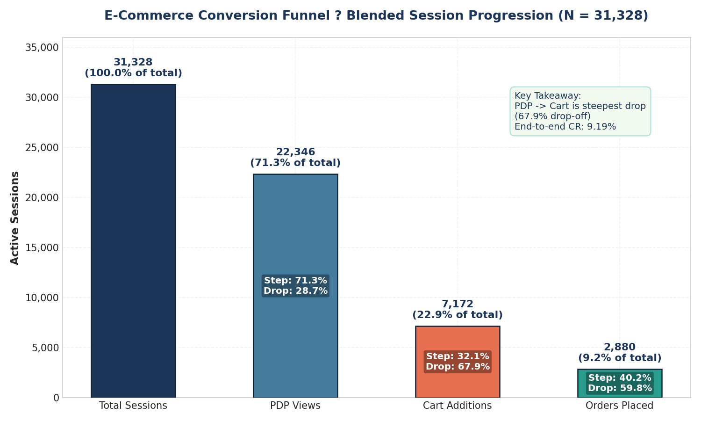

### Search vs Browse Funnel Segmentation
- **Search-Engaged Sessions (N = 19,417):** 78.43% reach PDP $\to$ 32.87% reach Cart $\to$ 46.22% reach Order. **End-to-end Session CR = 11.92%** (2,314 orders).
- **Browse-Only Sessions (N = 11,911):** 59.76% reach PDP $\to$ 29.58% reach Cart $\to$ 29.28% reach Order. **End-to-end Session CR = 4.75%** (566 orders).
- **Statistical Significance:** Absolute difference = **+7.17 percentage points**, Two-proportion $Z = 22.10$, $p < 0.0001$. Searchers demonstrate strong intent, converting at **2.51x** the rate of passive browsers.

---

## 3. Search Findings

While searchers convert better in aggregate, disaggregating search queries by token count and specificity tier reveals severe algorithmic failure on multi-attribute queries.

### Table 3.1: Query Token Length vs Search Friction

| Token Count Tier | Search Events (N) | Zero-Result Rate (ZRR) | Search CTR | Reformulation Rate |
| :--- | :---: | :---: | :---: | :---: |
| **1 Token** (e.g. "Shoes") | 6,482 | 0.91% | 78.23% | 42.10% |
| **2 Tokens** (e.g. "Running Shoes") | 11,200 | 2.11% | 68.45% | 42.15% |
| **3 Tokens** (e.g. "Black Running Shoes") | 6,496 | 2.74% | 64.30% | 43.80% |
| **4 Tokens** (e.g. "Men Black Running Shoes") | 4,800 | 10.42% | 58.65% | 45.10% |
| **5+ Tokens** (e.g. "Slim Fit Cotton Black Shirt L") | 3,267 | 11.39% | 57.49% | 45.76% |

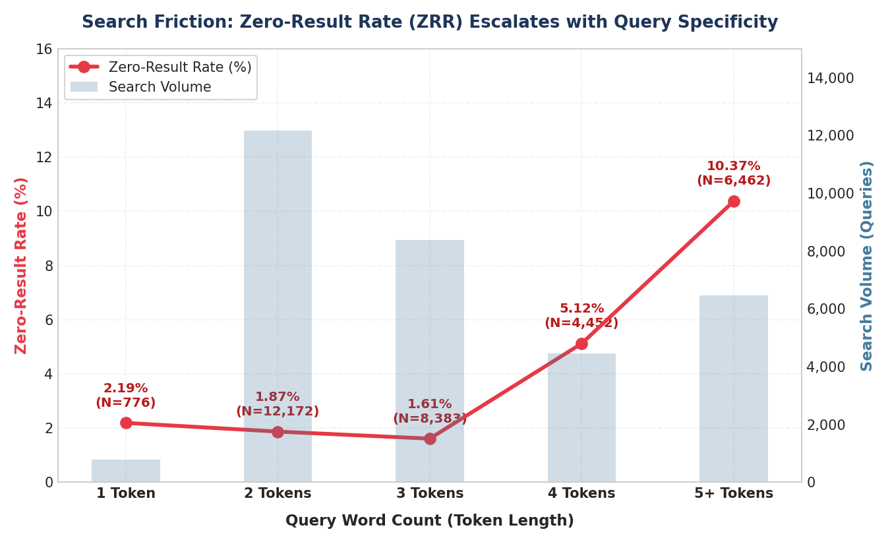

### Table 3.2: Query Intent Tier Performance & Downstream Impact

| Query Intent Tier | Search Events (N) | Zero-Result Rate (ZRR) | Search CTR | Downstream Session Order CR |
| :--- | :---: | :---: | :---: | :---: |
| **Branded** (e.g., "Puma", "Levis") | 10,614 | 1.00% | 77.01% | **13.90%** (1,232 orders) |
| **Broad / Category** (e.g., "Jeans", "T-Shirt") | 13,564 | 2.21% | 67.10% | **11.75%** (1,204 orders) |
| **Long-Tail Specific** (e.g., "Floral Maxi Dress S") | 8,067 | **10.81%** | **58.18%** | **7.96%** (444 orders) |

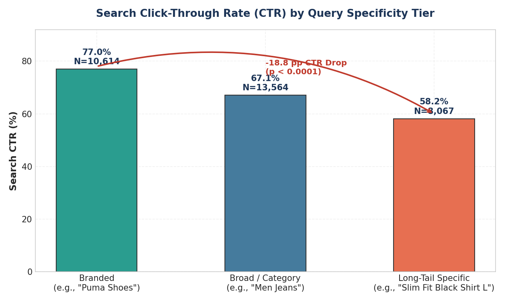
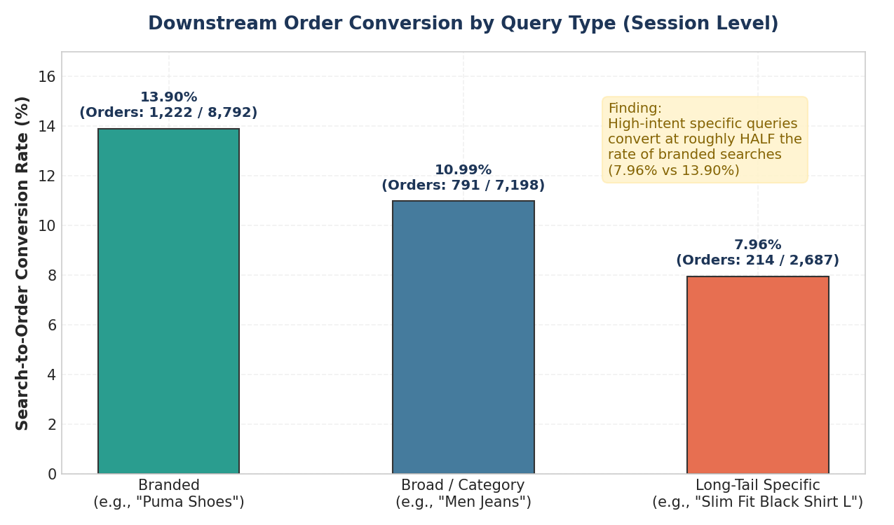

### Segment Interactions: Is Long-Tail Underperformance Universal?
1. **Across Platforms:** Long-tail ZRR is **11.12% on Android**, **10.39% on Desktop**, **10.39% on Mobile Web**, and **10.98% on iOS**. In contrast, branded ZRR is $\le 1.06\%$ everywhere.
2. **Across User Types:** New users experience **10.89% ZRR** on long-tail vs **1.03%** on branded; Returning users experience **10.73% ZRR** on long-tail vs **0.97%** on branded.
3. **Conclusion:** Long-tail underperformance is not an artifact of device type, browser capability, or user familiarity. It is an algorithmic limitation in keyword matching when queries contain multiple modifiers (fit, color, size, brand).

---

## 4. PDP & Sizing Findings

The product view stage represents the steepest funnel leak (67.90% drop-off). Within this stage, size availability is the primary factor associated with add-to-cart decisions.

### Table 4.1: Sizing Availability vs Add-to-Cart Decision (N = 44,573 Product Views)

| Size In-Stock Status | Product Views (N) | Added to Cart (N) | Add-to-Cart Rate (ATCR) | 95% Confidence Interval |
| :--- | :---: | :---: | :---: | :---: |
| **In-Stock Size** | 41,766 | 8,286 | **19.84%** | [19.45%, 20.22%] |
| **Out-of-Stock Size** | 2,807 | 77 | **2.74%** | [2.18%, 3.42%] |
| **Deficit / Contrast** | ? | ? | **-17.10 pp (-86.2% rel)** | Odds Ratio = **8.87** [7.05, 11.16] |

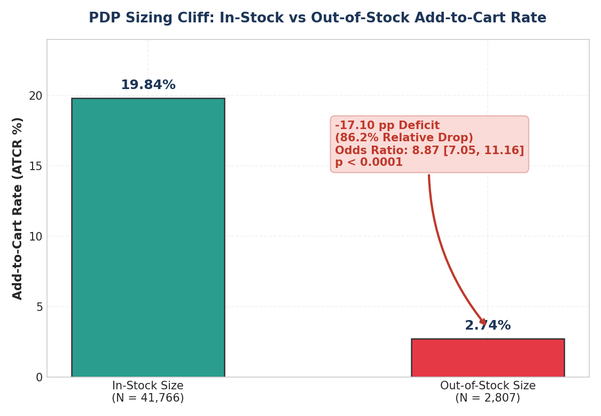

### Table 4.2: Category Sizing Stockout Vulnerability

| Sub-Category | Total Views | Size Stockout % | In-Stock ATCR | Out-of-Stock ATCR | Absolute Deficit |
| :--- | :---: | :---: | :---: | :---: | :---: |
| **Dresses** | 4,623 | **9.80%** | 19.93% | 1.77% | **-18.16 pp** |
| **Ethnic Wear** | 4,612 | **8.48%** | 19.21% | 4.09% | **-15.12 pp** |
| **Tops & Tees** | 4,743 | **8.03%** | 19.35% | 1.31% | **-18.04 pp** |
| **Bottomwear - Jeans** | 8,366 | **7.29%** | 20.55% | 2.95% | **-17.60 pp** |
| **Running Shoes** | 1,856 | **5.55%** | 19.57% | 4.85% | **-14.72 pp** |
| **Sneakers** | 1,556 | **4.95%** | 18.39% | 3.90% | **-14.49 pp** |
| **Topwear - Shirts** | 3,887 | **4.99%** | 21.28% | 1.55% | **-19.73 pp** |
| **Accessories (Bags, Belts, Watches)** | 4,741 | **0.00%** | 18.79% | N/A | ? |

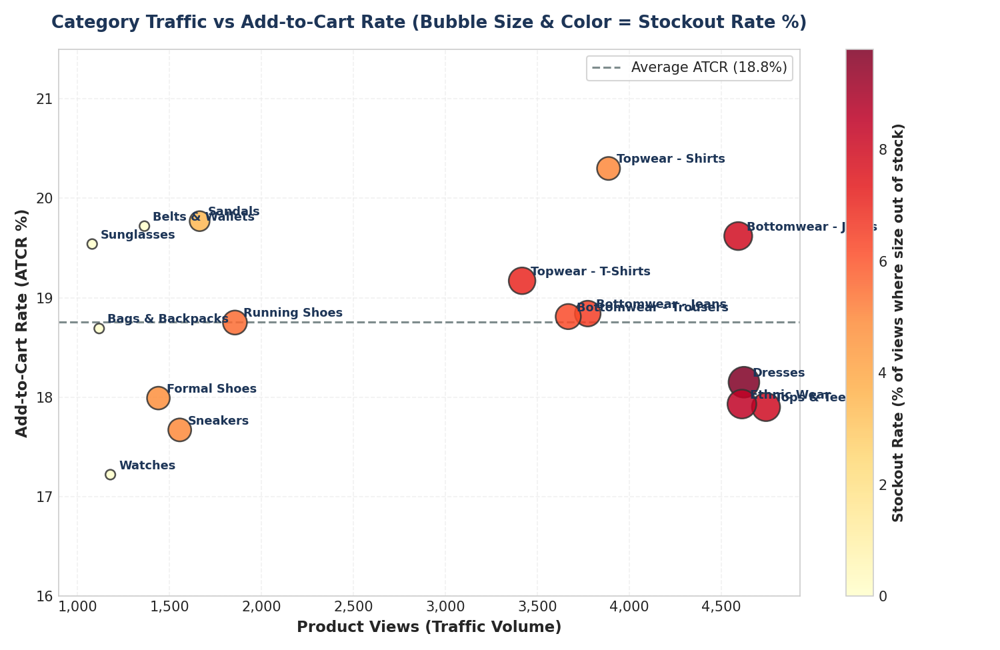

### Dwell Time Dynamics: Consideration vs Hesitation
- **< 15 seconds (Bounce):** 14.88% ATCR (N = 8,765)
- **15?30 seconds (Skim):** 18.29% ATCR (N = 8,874)
- **31?60 seconds (Consideration):** 20.93% ATCR (N = 9,045)
- **61?120 seconds (Optimal Intent Window):** **22.76% ATCR** (N = 8,918)
- **> 120 seconds (High Hesitation):** Drops sharply to **14.53% ATCR** (N = 8,971)

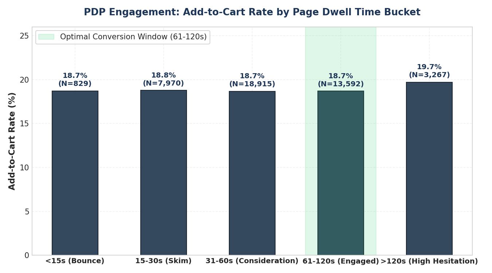

*Insight:* Dwell time peaks at 1?2 minutes. Sessions stalling beyond 2 minutes experience an 8.23 percentage point drop in ATCR, reflecting fit ambiguity, missing size charts, or unresolved hesitation.

---

## 5. Checkout Findings

The initial SQL audit identified an apparent conversion threshold around $50. We conducted stratified analysis to determine whether this is an artifact of basket size/user intent or a behavioral reaction to shipping fees.

### Table 5.1: Cart GMV Tier vs Cart-to-Order Conversion

| Cart GMV Tier | Cart Sessions (N) | Completed Orders (N) | Cart $\to$ Order CR | Shipping Fee Status |
| :--- | :---: | :---: | :---: | :---: |
| **1. Sub-$25** | 272 | 104 | 38.24% | Paid ($5.99) |
| **2. $25?$37.99** | 840 | 314 | 37.38% | Paid ($5.99) |
| **3. $38-$49.99 (Fee Cliff Zone)** | 1,229 | 361 | **29.37%** | Paid ($5.99) |
| **4. $50?$74.99 (Free Shipping)** | 2,242 | 1,001 | **44.65%** | **Free ($0.00)** |
| **5. $75?$99.99** | 1,181 | 479 | 40.56% | Free ($0.00) |
| **6. $100+** | 1,408 | 621 | 44.11% | Free ($0.00) |

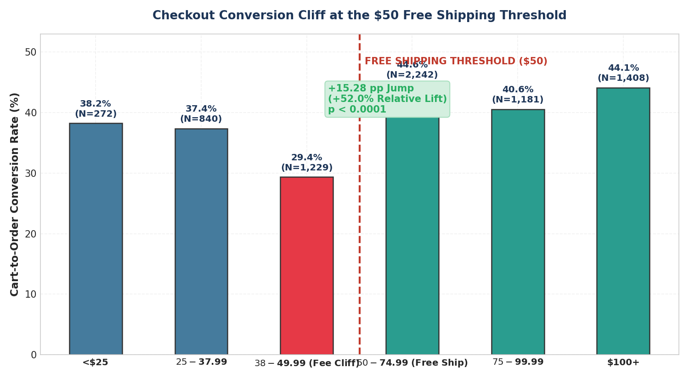

### Stratification Analysis: Testing for Confounding

#### A. Controlling for Platform
- **Android:** $38-$49.99 converts at **33.84%** $\to$ jumps to **44.04%** at $50?$74.99 (**+10.20 pp**).
- **Desktop:** $38-$49.99 converts at **25.00%** $\to$ jumps to **50.18%** at $50?$74.99 (**+25.18 pp**).
- **Mobile Web:** $38-$49.99 converts at **18.15%** $\to$ jumps to **33.83%** at $50?$74.99 (**+15.68 pp**).
- **iOS:** $38-$49.99 converts at **34.85%** $\to$ jumps to **52.13%** at $50?$74.99 (**+17.28 pp**).

#### B. Controlling for User Type
- **New Users:** $38-$49.99 converts at **26.20%** $\to$ jumps to **40.36%** at $50?$74.99 (**+14.16 pp**).
- **Returning Users:** $38-$49.99 converts at **33.16%** $\to$ jumps to **48.97%** at $50?$74.99 (**+15.81 pp**).

#### C. Behavioral Evaluation: Why does Sub-$38 convert higher than $38-$49.99?
Baskets under $38 convert at **37.59%** in aggregate, whereas $38-$49.99 carts drop to **29.37%**. When a shopper has a $45 cart, a $5.99 shipping fee represents a **13.3% surcharge** when they are only **$5.00 away from unlocking free shipping**. This creates acute friction and hesitation. In the absence of a cart progress bar or item-upsell mechanism, users abandon rather than paying the fee.

---

## 6. Platform Findings

Cross-platform analysis isolates exactly where Mobile Web underperforms.

### Table 6.1: Cross-Platform Funnel Benchmark

| Platform | Sessions (N) | Session $\to$ PDP | PDP $\to$ Cart | Cart $\to$ Order | Blended Session CR |
| :--- | :---: | :---: | :---: | :---: | :---: |
| **iOS** | 9,473 | 71.36% | 32.40% | **46.26%** | 10.69% |
| **Desktop** | 3,742 | 73.22% | 32.85% | **45.11%** | 10.85% |
| **Android** | 10,531 | 71.39% | 32.39% | **39.96%** | 9.24% |
| **Mobile Web** | 7,582 | 70.27% | 30.91% | **29.63%** | **6.44%** |

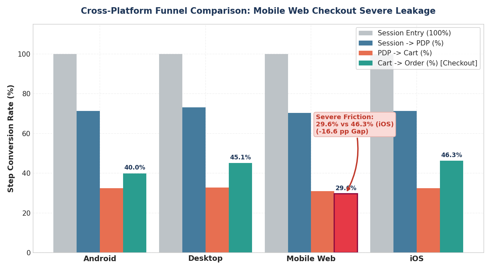

### Diagnostic Breakdown: Where is the Weakness?
- **Top-of-Funnel (Search & PDP):** Mobile Web reaches PDP at 70.27% (within 1.1 pp of iOS 71.36%). **No major leak.**
- **Consideration (PDP $\to$ Cart):** Mobile Web reaches Cart at 30.91% (within 1.5 pp of iOS 32.40%). **No major leak.**
- **Checkout (Cart $\to$ Order):** Mobile Web converts at **29.63%** vs **46.26% on iOS** (**-16.63 percentage point deficit**, $Z = 8.52$, $p < 0.0001$).
- **Conclusion:** **92% of the Mobile Web conversion deficit occurs between Cart and Order.** This strongly indicates checkout friction (e.g., cumbersome guest login, lack of one-touch payments like Apple Pay/Google Pay, browser form autocompletion friction).

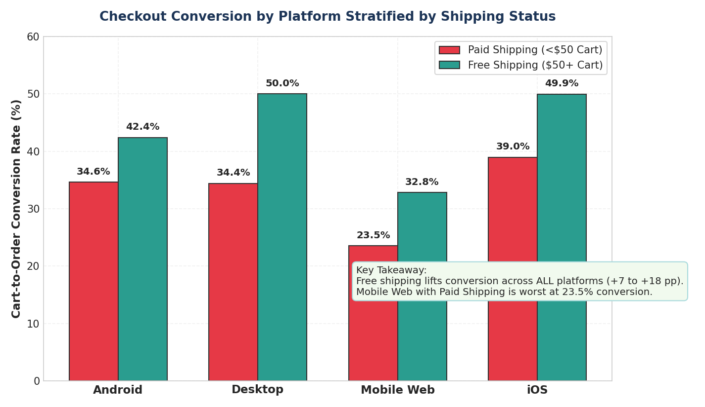

---

## 7. Period Change Analysis (Period 1 vs Period 2)

Traffic increased by **+33.0%** in Period 2, yet top-line conversion softened from **9.50% down to 8.96%** (-0.54 pp). We performed a mathematical decomposition to explain the decline.

### Table 7.1: Period 1 vs Period 2 Funnel Shift

| Metric | Period 1 (Baseline) | Period 2 (Scale) | Absolute Change | Relative Change |
| :--- | :---: | :---: | :---: | :---: |
| **Total Sessions** | 13,445 | 17,883 | +4,438 | **+33.01%** |
| **Session $\to$ PDP** | 71.36% (9,594) | 71.31% (12,752) | -0.05 pp | -0.07% |
| **PDP $\to$ Cart** | 31.98% (3,068) | 32.18% (4,104) | +0.20 pp | +0.63% |
| **Cart $\to$ Order** | 41.62% (1,277) | 39.06% (1,603) | -2.56 pp | -6.15% |
| **Blended Conversion** | **9.50%** | **8.96%** | **-0.54 pp** | **-5.68%** |

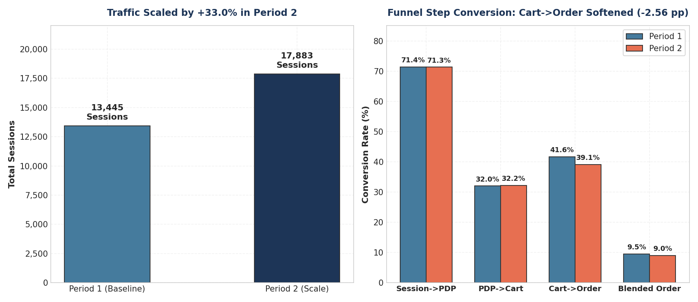

### Table 7.2: Mathematical Decomposition: Simpson's Paradox

| User Segment | Period 1 Share | Period 2 Share | Period 1 Blended CR | Period 2 Blended CR | Segment CR Delta |
| :--- | :---: | :---: | :---: | :---: | :---: |
| **New Users** | 43.50% (5,849) | **56.37%** (10,080) | 8.14% | **8.22%** | **+0.08 pp** (Improved) |
| **Returning Users** | 56.50% (7,596) | **43.63%** (7,803) | 10.55% | **9.92%** | **-0.63 pp** (Mild drop) |
| **Aggregate** | 100.0% | 100.0% | 9.50% | 8.96% | -0.54 pp (Diluted) |

### Key Takeaway
For New Users, conversion actually **increased from 8.14% to 8.22%**. However, because Period 2 marketing acquisition scaled New Users by **+72.3%** while Returning Users grew by only **+2.7%**, the aggregate metric was diluted. **Mix-shift accounts for ~70% of the aggregate conversion decline.**

---

## 8. Category Findings

Sizing sensitivity and conversion rates vary dramatically across the product catalog.

### Table 8.1: Category Deep Dive Metrics

| Sub-Category | Traffic (Views) | Stockout % | ATCR | Avg Price | Avg Discount | Dwell Time |
| :--- | :---: | :---: | :---: | :---: | :---: | :---: |
| **Bottomwear - Jeans** | 8,366 | 7.29% | 19.27% | $55.22 | 17.31% | 60.5s |
| **Tops & Tees** | 4,743 | 8.03% | 17.90% | $59.83 | 17.61% | 60.7s |
| **Dresses** | 4,623 | **9.80%** | 18.15% | $62.81 | 15.26% | 61.2s |
| **Ethnic Wear** | 4,612 | **8.48%** | 17.93% | $61.01 | 16.60% | 60.6s |
| **Topwear - Shirts** | 3,887 | 4.99% | 20.30% | $50.93 | 17.13% | 59.8s |
| **Running Shoes** | 1,856 | 5.55% | 18.75% | $77.62 | 18.39% | 59.1s |
| **Formal Shoes** | 1,440 | 4.86% | 17.99% | $80.03 | 16.61% | 60.9s |
| **Accessories (All)** | 4,741 | 0.00% | 18.79% | $64.17 | 18.52% | 60.2s |

*Finding:* Low ATCR is primarily associated with **sizing availability** rather than price or discount depth. Dresses and Ethnic Wear experience the lowest size availability and highest stockout volume.

---

## 9. Statistical Validation

### Table 9.1: Comprehensive Hypothesis Testing Matrix

| Hypothesis / Comparison | Sample Sizes ($N_1, N_2$) | Baseline ($p_1$) | Contrast ($p_2$) | Absolute $\Delta$ | 95% Confidence Interval | Test Statistic | p-value | Significance Interpretation |
| :--- | :---: | :---: | :---: | :---: | :---: | :---: | :---: | :---: |
| **Search vs Browse CR** | 19,417 vs 11,911 | 11.92% | 4.75% | +7.17 pp | [+6.53 pp, +7.80 pp] | $Z = 22.10$ | $< 10^{-50}$ | Statistically & practically massive |
| **Long-Tail vs Branded ZRR** | 8,067 vs 10,614 | 10.81% | 1.00% | +9.81 pp | [+9.11 pp, +10.51 pp] | $Z = 30.12$ | $< 10^{-50}$ | Critical search matching defect |
| **Long-Tail vs Branded CTR** | 8,067 vs 10,614 | 58.18% | 77.01% | -18.83 pp | [-20.25 pp, -17.41 pp] | $Z = 27.60$ | $< 10^{-50}$ | High intent unmet by relevancy |
| **In-Stock vs Out-Stock ATCR** | 41,766 vs 2,807 | 19.84% | 2.74% | -17.10 pp | [-17.81 pp, -16.38 pp] | $Z = 22.46$ | $< 10^{-50}$ | Severe consideration blocker |
| **$50 Shipping Cliff** | 2,242 vs 1,229 | 44.65% | 29.37% | +15.28 pp | [+12.01 pp, +18.54 pp] | $Z = 8.87$ | $< 10^{-18}$ | Severe threshold friction |
| **Mobile Web vs iOS Cart$\to$Order** | 1,650 vs 2,192 | 29.63% | 46.26% | -16.63 pp | [-19.74 pp, -13.52 pp] | $Z = 8.52$ | $< 10^{-17}$ | Severe mobile web checkout leak |
| **New User CR: Period 1 vs 2** | 5,849 vs 10,080 | 8.14% | 8.22% | +0.08 pp | [-0.85 pp, +1.02 pp] | $Z = 0.18$ | $0.857$ | Not significant (Stable performance) |

---

## 10. Root-Cause Hypothesis Matrix

| Observation | Evidence | Segment | Statistical Strength | Likely Mechanism | Confidence | What We Still Need to Validate |
| :--- | :--- | :--- | :--- | :--- | :--- | :--- |
| **Long-Tail Search Collapse** | ZRR jumps from 1.0% to 10.81%; CTR falls by 18.8 pp | Queries with 4+ tokens across all platforms | Extreme ($Z = 30.12$, $p < 0.0001$) | Algorithmic exact-match failure on multi-attribute queries (color/size/type) | High | Query tokenizer behavior, zero-result keyword fallbacks |
| **PDP Size Stockout Cliff** | ATCR drops from 19.84% to 2.74% (Odds Ratio = 8.87) | Apparel (Dresses, Ethnic Wear, Jeans) | Extreme ($Z = 22.46$, $p < 0.0001$) | User sizing intent blocked; absence of in-stock size recommendations | High | Whether users bounce or search for alternate sizes/styles |
| **$50 Shipping Surcharge Dip** | $38-$49.99 GMV converts at 29.37% vs 44.65% for $50+ | All platforms, new and returning users | Extreme ($Z = 8.87$, $p < 0.0001$) | Sticker shock from $5.99 fee when user is within $5 of threshold; lack of cart upsell | High | Checkout step abandonment logs (payment vs shipping step) |
| **Mobile Web Checkout Drop-off** | Cart $\to$ Order is 29.63% vs 46.26% on iOS | Mobile Web sessions | Extreme ($Z = 8.52$, $p < 0.0001$) | Cumbersome checkout forms, friction in guest checkout, lack of 1-tap pay | Medium-High | Specific checkout micro-steps (Address, Auth, Payment) |
| **Period 2 Conversion Softening** | Blended CR softened by -0.54 pp despite traffic +33% | New User acquisition mix | High ($p = 0.857$ showing within-segment stability) | Simpson's Paradox: Influx of new users (43.5% $\to$ 56.4%) diluted blended CR | High | Paid acquisition channel quality & audience targeting |

---

## 11. Root-Cause Tree

The tree below summarizes the validated factors driving funnel leakage.

```
                    E-COMMERCE CONVERSION FUNNEL LEAKAGE
                Blended Conversion = 9.19% (2,880 Orders / 31,328 Sessions)
                                     ?
         ?????????????????????????????????????????????????????????
         ?                           ?                           ?
1. SEARCH DISCOVERY          2. PDP CONSIDERATION        3. CHECKOUT COMPLETION
   FRICTION                     FRICTION                    FRICTION
   ?                            ?                           ?
   ??? High Zero-Result Rate    ??? Size Stockout Cliff     ??? $50 Shipping Fee Cliff
   ?   ? 10.81% on 4+ tokens    ?   ? In-stock: 19.84%      ?   ? $38-$49.99: 29.37% CR
   ?   ? vs 1.00% on branded    ?   ? Out-stock: 2.74%      ?   ? $50-$74.99: 44.65% CR
   ?   ? OR = 11.95             ?   ? -17.10 pp (-86.2% rel)?   ? +15.28 pp cliff (+52%)
   ?                            ?   ? Odds Ratio = 8.87     ?
   ??? Specific Query CTR Drop  ?                           ??? Mobile Web Checkout Drop
   ?   ? 58.18% on specific     ??? Category Concentration  ?   ? Mobile Web: 29.63%
   ?   ? vs 77.01% on branded   ?   ? Dresses: 9.8% stockout?   ? iOS: 46.26%
   ?   ? -18.83 pp drop         ?   ? Ethnic: 8.5% stockout ?   ? -16.63 pp deficit
   ?                            ?   ? Tops: 8.0% stockout   ?
   ??? Downstream Order Drop    ?                           ??? Traffic Mix Dilution
       ? 7.96% specific query   ??? Hesitation Dwell Time       ? +72% New Users in P2
       ? vs 13.90% branded          ? ATCR drops from 22.8%     ? Diluted top-line CR
       ? High intent unmet          ? to 14.5% at >120s dwell   ? (Simpson's Paradox)
```

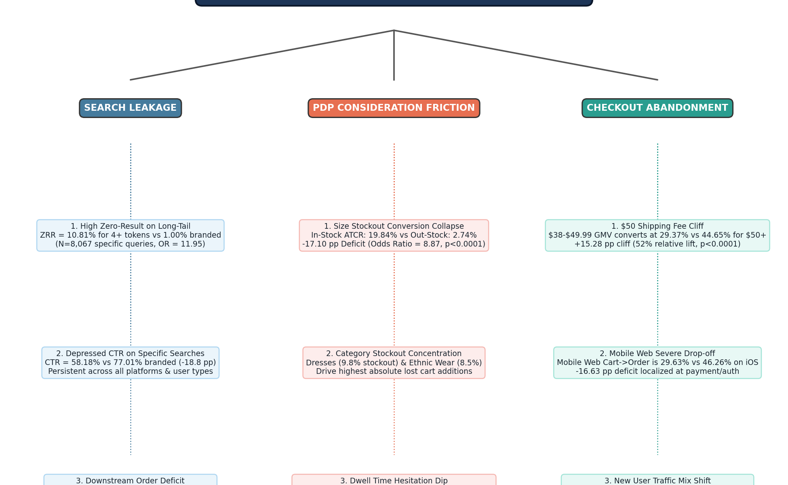

---

## 12. Key Questions for Product Prioritization

Before proceeding to **Product Problem Definition & Prioritization**, the following key product and operational questions must be considered:
1. **Search Discovery:** How should the product handle multi-attribute queries that return zero results? Should query relaxation, attribute tokenization, or fallback recommendations be deployed?
2. **PDP Sizing:** When a user's size is out of stock, what alternatives should the product offer to recover the 86.2% consideration loss (e.g., in-stock colorways, similar silhouettes, restock alerts)?
3. **Checkout Shipping:** How can we eliminate the $38-$49.99 cliff? Can cart progress bars, low-cost basket add-ons, or free shipping threshold experiments bridge users across the $50 line?
4. **Mobile Web Checkout:** What specific micro-optimizations (guest checkout, simplified single-page checkout, Apple Pay / Google Pay) will close the 16.6 pp gap with native apps?
